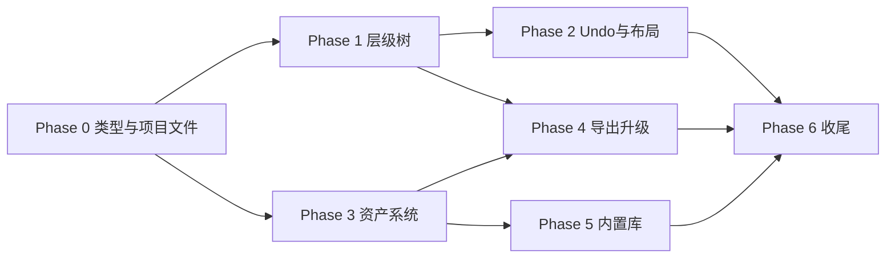

# FX Studio 2.0 开发步骤表

| 字段 | 内容 |
|------|------|
| 关联 PRD | [PRD-v2.md](./PRD-v2.md) |
| 文档版本 | v1.0 |
| 最后更新 | 2026-07-23 |
| 预估总工期 | 8–12 周（1 人全职等效） |

---

## 总览

```
Phase 0  基础重构（1 周）     ──► 类型 / Store / 项目文件骨架
Phase 1  层级树（2 周）       ──► 多 Emitter 编辑 + 预览合成
Phase 2  编辑体验（1.5 周）   ──► Undo/Redo + 移除历史 + 布局改版
Phase 3  资产系统（2.5 周）   ──► Registry + 浏览器 + 引用槽
Phase 4  导出/import（1.5 周）──► 多节点 Prefab + 资产打包
Phase 5  内置库 & 迁移（1 周） ──► 内置资产 + v1 迁移
Phase 6  AI 适配 & 收尾（1 周）──► AI 降级 + 测试 + 文档
```

---

## Phase 0：基础重构（第 1 周）

| 步骤 | 任务 | 产出文件 / 模块 | 优先级 | 预估 |
|------|------|-------------------|--------|------|
| 0.1 | 定义 v2 类型：`EffectProject`、`EffectNode`、`ParticleEmitterNode`、`AssetEntry`、`AssetRef` | `src/types/project.ts`, `src/types/asset.ts` | P0 | 1d |
| 0.2 | 实现 `.fxproj` 序列化 / 反序列化 | `src/utils/project-io.ts` | P0 | 1d |
| 0.3 | 新建 `project-store` 替代 `session-store` 核心逻辑 | `src/stores/project-store.ts` | P0 | 1.5d |
| 0.4 | Electron IPC：打开/保存文件对话框 | `electron/main.ts`, `preload.ts` | P0 | 0.5d |
| 0.5 | 启动页 / 新建项目 / 打开项目最小流程 | `src/components/layout/ProjectWelcome.tsx` | P0 | 1d |
| 0.6 | 单元测试：project-io round-trip | `tests/project-io.test.ts` | P0 | 0.5d |

**Phase 0 完成标准**：能新建空 `.fxproj`，保存后再打开，数据一致。

---

## Phase 1：层级树与多 Emitter（第 2–3 周）

| 步骤 | 任务 | 产出 | 优先级 | 预估 |
|------|------|------|--------|------|
| 1.1 | `HierarchyPanel` 组件：树形 UI + 选中态 | `src/components/hierarchy/HierarchyPanel.tsx` | P0 | 2d |
| 1.2 | 树操作：添加 Emitter / Group、删除、重命名 | `src/stores/project-store.ts` actions | P0 | 1d |
| 1.3 | 拖拽 reparent（`@dnd-kit` 或原生） | `HierarchyPanel` + store | P0 | 1.5d |
| 1.4 | Transform Inspector（position/rotation/scale） | `InspectorPanel` 扩展 | P0 | 1d |
| 1.5 | 多 Emitter 预览：`PreviewEngine` 遍历可见 Emitter | `src/utils/composite-preview.ts` | P0 | 2d |
| 1.6 | Solo / Hide 节点 | Hierarchy + preview filter | P1 | 0.5d |
| 1.7 | 复制 / 粘贴 Emitter（Ctrl+D） | store + shortcuts | P1 | 1d |
| 1.8 | 层级树展开显示模块子节点 | 复用 `modules.ts` | P1 | 1d |
| 1.9 | 替换 App 左栏：`EffectTreePanel` → `HierarchyPanel` | `App.tsx` | P0 | 0.5d |

**Phase 1 完成标准**：一个项目内 3 个 Emitter 可独立编辑、同屏预览、Transform 生效。

---

## Phase 2：编辑体验改版（第 3–4.5 周）

| 步骤 | 任务 | 产出 | 优先级 | 预估 |
|------|------|------|--------|------|
| 2.1 | 命令模式 Undo/Redo 栈 | `src/stores/history-store.ts` 或 project-store 内置 | P0 | 2d |
| 2.2 | 接入 Inspector / Hierarchy 变更 | 所有 `update*` 走 command | P0 | 1.5d |
| 2.3 | 快捷键 Ctrl+Z / Ctrl+Y | `useKeyboardShortcuts.ts` | P0 | 0.5d |
| 2.4 | 移除 `VersionHistoryPanel` 及 session `versionHistory` | 删除 + 清理引用 | P0 | 0.5d |
| 2.5 | 左栏 Tab 重构：默认「层级」，移除「历史」 | `App.tsx`, `app-store.ts` | P0 | 0.5d |
| 2.6 | AI 面板改为可折叠 `AIAssistantPanel` | `ChatPanel` 重构 | P1 | 1d |
| 2.7 | 工具栏改版：文件菜单 + 撤销重做 + AI Toggle | `App.tsx` 工具栏 | P1 | 1d |
| 2.8 | 自动保存（debounce 30s → localStorage 备份） | `project-store.ts` | P1 | 0.5d |
| 2.9 | 状态栏改版：项目名 + 选中节点 | 状态栏组件 | P2 | 0.5d |

**Phase 2 完成标准**：无历史 Tab；Undo 可恢复删除节点与参数修改；AI 默认隐藏。

---

## Phase 3：资产系统（第 4.5–7 周）

| 步骤 | 任务 | 产出 | 优先级 | 预估 |
|------|------|------|--------|------|
| 3.1 | `AssetRegistry` store：内置 + 项目资产 | `src/stores/asset-store.ts` | P0 | 1d |
| 3.2 | 内置资产目录结构 + 首批 PNG | `public/assets/builtin/textures/` | P0 | 1.5d |
| 3.3 | 资产缩略图生成（Canvas / 缓存） | `src/utils/asset-thumbnail.ts` | P0 | 1d |
| 3.4 | `AssetBrowserPanel` UI（网格 + 分类树） | `src/components/assets/AssetBrowserPanel.tsx` | P0 | 2d |
| 3.5 | 拖入导入 png/fbx（Electron + Web） | `useAssetImport.ts` | P0 | 1d |
| 3.6 | `AssetSlot` Inspector 组件（缩略图/清除/替换） | `src/components/inspector/AssetSlot.tsx` | P0 | 1.5d |
| 3.7 | `rendererModule` 扩展：`mainTextureRef`, `materialRef`, `meshRef` | `types/effect.ts`, defaults | P0 | 1d |
| 3.8 | 预览加载真实贴图（TextureLoader） | `base-particle-preview.ts` | P0 | 1d |
| 3.9 | 资产搜索 / 类型过滤 | AssetBrowser | P1 | 0.5d |
| 3.10 | 双击资产预览弹窗 | `AssetPreviewModal.tsx` | P2 | 1d |
| 3.11 | 从资产浏览器拖拽到 Hierarchy 创建 Emitter | DnD 集成 | P1 | 1d |

**Phase 3 完成标准**：Inspector 可换贴图；预览与导出使用同一 AssetRef；资产浏览器可浏览内置库。

---

## Phase 3.5：全局属性窗口（第 7 周，与 Phase 4 并行）

| 步骤 | 任务 | 产出 | 优先级 | 状态 |
|------|------|------|--------|------|
| 3.5.1 | `PropertiesPanel` 路由：节点 / 资产二选一 | `src/components/properties/` | P0 | ✅ |
| 3.5.2 | 资产浏览器选中同步至右侧；移除内嵌详情栏 | `AssetBrowserPanel.tsx` | P0 | ✅ |
| 3.5.3 | 资产 CRUD + 通用操作条 | `asset-registry.ts`, `AssetEditorActions` | P0 | ✅ |
| 3.5.4 | 分类型编辑器（贴图/精灵帧/材质/Shader/模型） | `editors/*AssetEditor.tsx` | P0 | ✅ |
| 3.5.5 | Esc 清空属性选中；空状态快捷提示 | `PropertiesEmptyState`, 快捷键 | P1 | ✅ |
| 3.5.6 | 右栏默认 320px；Shader 选中自动扩宽 | `inspector-target.ts` | P1 | ✅ |
| 3.5.7 | 贴图导入落盘 `assets/textures/` | `useAssetImport.ts` | P2 | 待办 |

**Phase 3.5 完成标准**：单击资产在右侧编辑属性；内置资产可复制到项目后修改；Esc 可清空属性面板。

---

## Phase 4：导出 / 导入升级（第 7–8.5 周）

| 步骤 | 任务 | 产出 | 优先级 | 预估 |
|------|------|------|--------|------|
| 4.1 | `CocosPrefabBuilder` 支持多 Emitter 递归 | `cocos-serializers.ts` | P0 | 2d |
| 4.2 | Group → 空 Node；Emitter → 带 ParticleSystem 子 Node | builder | P0 | 1d |
| 4.3 | Transform 写入 `_lpos/_lrot/_lscale` | builder | P0 | 0.5d |
| 4.4 | 导出资产收集：遍历 AssetRef → 复制 png/mtl/meta | `export-pipeline.ts` | P0 | 1.5d |
| 4.5 | 导入多节点 prefab：解析 Node 树 → EffectProject | `prefab-importer.ts` | P0 | 2d |
| 4.6 | 导入 material/texture UUID → AssetEntry | importer + registry | P1 | 1d |
| 4.7 | ExportModal 展示资产清单 | `ExportModal.tsx` | P1 | 0.5d |
| 4.8 | 测试：3 Emitter 爆炸项目 round-trip | `tests/export-composite.test.ts` | P0 | 1d |

**Phase 4 完成标准**：「爆炸+烟雾+光晕」导出 Cocos 后三粒子系统均正常；贴图非默认圆点时可正确导出。

---

## Phase 5：内置库与迁移（第 8.5–9.5 周）

| 步骤 | 任务 | 产出 | 优先级 | 预估 |
|------|------|------|--------|------|
| 5.1 | 内置贴图包（≥10 张） | `public/assets/builtin/textures/*` | P0 | 1d |
| 5.2 | 内置材质定义（additive / alpha blend） | `assets/builtin/materials/` | P1 | 1d |
| 5.3 | 内置模型（quad + cone） | `assets/builtin/meshes/` | P2 | 1d |
| 5.4 | 预设组合：爆炸/魔法/环境模板 → 多 Emitter 项目 | `data/preset-projects/` | P1 | 1d |
| 5.5 | v1 Session → v2 Project 迁移工具 | `src/utils/migrate-v1.ts` | P0 | 1d |
| 5.6 | 首次启动检测 v1 localStorage 并提示迁移 | 启动页 | P1 | 0.5d |

**Phase 5 完成标准**：新用户可直接从预设组合项目开始；老用户可迁移 Session。

---

## Phase 6：AI 适配与收尾（第 9.5–10.5 周）

| 步骤 | 任务 | 产出 | 优先级 | 预估 |
|------|------|------|--------|------|
| 6.1 | AI 生成目标改为「当前选中 Emitter」 | `ai-engine.ts`, `ChatPanel` | P1 | 1d |
| 6.2 | AI 命令：「添加烟雾子特效」→ 新建 Emitter 节点 | ai-engine 扩展 | P2 | 1d |
| 6.3 | 模板库入口迁入资产浏览器 | 删除独立 TemplateLibrary 或保留为预设 | P1 | 0.5d |
| 6.4 | 更新 PRD / README / 用户指南 | `docs/` | P0 | 0.5d |
| 6.5 | E2E 冒烟：新建 → 3 Emitter → 换贴图 → 导出 → Cocos | 测试清单 | P0 | 1d |
| 6.6 | 性能 profiling：5×200 粒子 | 优化项 backlog | P1 | 0.5d |

**Phase 6 完成标准**：v2.0 功能完整，文档齐全，核心路径冒烟通过。

---

## 依赖关系图



---

## 人力建议（可并行）

| 轨道 | 负责人 | Phase | 说明 |
|------|--------|-------|------|
| A 轨道 | 前端主程 | 0 → 1 → 2 | 层级树 + Store + UI 改版 |
| B 轨道 | 工具/引擎 | 3 → 4 | 资产系统 + 导出管线 |
| 交叉 | 全员 | 5 → 6 | 内置库、迁移、测试 |

Phase 1 与 Phase 3 可在 Phase 0 完成后 **并行**（A 做层级，B 做 AssetRegistry + 浏览器）。

---

## 技术选型建议

| 领域 | 建议 | 原因 |
|------|------|------|
| 树拖拽 | `@dnd-kit/core` | 比 react-dnd 轻，与 React 18 兼容 |
| Undo | `immer` + patch 栈 或 `zundo` | 与 Zustand 集成快 |
| 资产缩略图 | 内存 LRU + IndexedDB 缓存 | 避免重复解码 PNG |
| 项目文件 | JSON + 可选 gzip | 可读、易 diff；后期可改 zip 包 |
| 内置资产 | `public/assets/builtin` | Vite 静态服务 + Electron 打包 |

---

## 每阶段 PR 切分建议

| PR | 标题 | 包含步骤 |
|----|------|----------|
| PR-1 | feat: v2 project types and .fxproj IO | 0.1–0.6 |
| PR-2 | feat: hierarchy panel and multi-emitter store | 1.1–1.5, 1.9 |
| PR-3 | feat: hierarchy DnD and transform | 1.3–1.4, 1.6–1.8 |
| PR-4 | feat: undo/redo and remove version history | 2.1–2.5 |
| PR-5 | refactor: toolbar and AI assistant panel | 2.6–2.9 |
| PR-6 | feat: asset registry and builtin textures | 3.1–3.3, 5.1 |
| PR-7 | feat: asset browser panel | 3.4–3.5, 3.9 |
| PR-8 | feat: asset slots in inspector | 3.6–3.8 |
| PR-9 | feat: multi-emitter cocos export | 4.1–4.4, 4.8 |
| PR-10 | feat: multi-node prefab import | 4.5–4.7 |
| PR-11 | feat: v1 migration and preset projects | 5.4–5.6 |
| PR-12 | chore: v2.0 docs and AI scope update | 6.1–6.6 |

---

## 验收清单（v2.0 Release）

- [ ] 可创建含 3+ Emitter 的组合特效项目
- [ ] 层级树拖拽 reparent，Undo 可恢复
- [ ] 资产浏览器显示内置贴图 ≥10 张
- [ ] Inspector 可替换 Main Texture，预览即时更新
- [ ] 导出 Cocos：多 ParticleSystem + 正确贴图文件
- [ ] 导入 Cocos 多节点 prefab 为 EffectProject
- [ ] 无「历史」Tab；Ctrl+Z 可用
- [ ] AI 面板可隐藏，隐藏后全流程可完成
- [ ] v1 Session 可迁移
- [ ] `npm run build` + `vitest` 全通过

---

## 变更记录

| 版本 | 日期 | 变更 |
|------|------|------|
| v1.0 | 2026-07-23 | 初版开发步骤表，对应 PRD-v2 |
