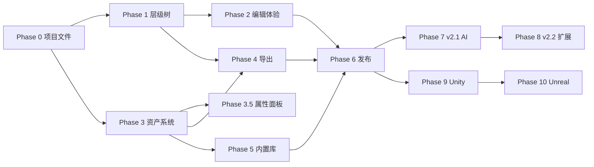

# FX Studio 开发步骤表

| 字段 | 内容 |
|------|------|
| 关联策略 | [PROJECT-PLAN.md](./PROJECT-PLAN.md) |
| 关联 PRD | [PRD-v2.md](./PRD-v2.md) |
| 文档版本 | **v2.0** |
| 最后更新 | 2026-07-23 |
| 当前整体进度 | **~82–85%**（v2.0 正式版冲刺中） |
| 预估剩余工期 | **1–2 周**（E2E + 发布门禁 + CI） |

---

## 终极目标

> **做一款最好用的特效制作软件——用户在此完成创作与预览后，可将特效导出到 Cocos Creator / Unity / Unreal 中开箱即用。**

| 引擎 | 状态 | 目标版本 |
|------|------|----------|
| Cocos Creator 3.8 | ✅ 一等公民（多节点 Prefab + 资产打包） | v2.0 |
| Unity 2022+ | 🔜 路线图 | v3.0（2027 H1） |
| Unreal 5 | 🔜 路线图 | v3.5（2027 H2） |

---

## 战略支柱 → Phase 映射

| 战略支柱 | 对应 Phase | 核心交付 |
|----------|------------|----------|
| **P1 编辑体验** | Phase 0–2 | `.fxproj`、层级树、Undo/Redo、Unity 级工作流 |
| **P2 资产体系** | Phase 3、3.5 | AssetRegistry、资产浏览器、引用槽、PropertiesPanel |
| **P3 引擎互通** | Phase 4–5 | Cocos 多节点导出/导入、round-trip、内置库、迁移 |
| **P4 智能辅助** | Phase 6、7 | AI 降级、选中 Emitter 生成、组合语义命令 |

---

## 里程碑时间表

| 里程碑 | 目标日期 | 验收主题 | 状态 |
|--------|----------|----------|------|
| v2.0-alpha | 2026-08 | 层级树 + `.fxproj` + Undo/Redo | 🔄 接近完成 |
| v2.0-beta | 2026-09 | 资产浏览器 + 引用槽 + 多节点导出 | 🔄 接近完成 |
| **v2.0 正式版** | **2026-10** | 迁移 + 文档 + 冒烟 + 发布门禁 | ⏳ 进行中 |
| v2.1 | 2026-11 | AI 选中 Emitter + 组合生成 | ⏳ 未开始 |
| v2.2 | 2026-12 | Shader 资产编辑 + Mesh 渲染 | ⏳ 未开始 |
| v3.0 | 2027 H1 | Unity Particle System 导出 | ⏳ 未开始 |
| v3.5 | 2027 H2 | Unreal Niagara 导出 | ⏳ 未开始 |

---

## 总览

```
Phase 0   基础重构（1 周）      ✅ ~95%   类型 / Store / .fxproj
Phase 1   层级树（2 周）        ✅ ~90%   多 Emitter 编辑 + 预览合成
Phase 2   编辑体验（1.5 周）    ✅ ~85%   Undo/Redo + 布局改版
Phase 3   资产系统（2.5 周）    ✅ ~90%   Registry + 浏览器 + 引用槽
Phase 3.5 全局属性窗口          ✅ ~95%   PropertiesPanel + 分类型编辑器
Phase 4   导出/导入（1.5 周）   ✅ ~85%   多节点 Prefab + 资产打包
Phase 5   内置库 & 迁移（1 周） ✅ ~80%   内置资产 + v1 迁移
Phase 6   收尾 & 发布（1 周）   🔄 ~55%   AI 适配 + E2E + 性能 + 文档
────────────────────────────────────────────────────────────────────
Phase 7   v2.1 AI 深度适配      ⏳        组合语义 + Emitter 作用域
Phase 8   v2.2 扩展能力         ⏳        Shader/Mesh + 时间轴评估
Phase 9   v3.0 Unity 导出       ⏳        模块映射 + Prefab
Phase 10  v3.5 Unreal 导出      ⏳        Niagara 映射
```

**图例**：✅ 已完成 · 🔄 进行中 · ⏳ 待办

---

## Phase 0：基础重构（P1 编辑体验 · 第 1 周）

**目标编号**：支撑 G-01（层级化组合编辑）  
**完成标准**：能新建空 `.fxproj`，保存后再打开，数据一致。

| 步骤 | 任务 | 产出文件 / 模块 | 优先级 | 状态 |
|------|------|-----------------|--------|------|
| 0.1 | 定义 v2 类型：`EffectProject`、`EffectNode`、`ParticleEmitterNode`、`AssetEntry`、`AssetRef` | `src/types/project.ts`, `src/types/asset.ts` | P0 | ✅ |
| 0.2 | 实现 `.fxproj` 序列化 / 反序列化 | `src/utils/project-io.ts` | P0 | ✅ |
| 0.3 | 新建 `project-store` 替代 `session-store` 核心逻辑 | `src/stores/project-store.ts` | P0 | ✅ |
| 0.4 | Electron IPC：打开/保存文件对话框 | `electron/main.ts`, `preload.ts` | P0 | ✅ |
| 0.5 | 启动页 / 新建项目 / 打开项目 / 最近项目 | `src/components/layout/ProjectWelcome.tsx` | P0 | ✅ |
| 0.6 | 单元测试：project-io round-trip | `tests/project-io.test.ts` | P0 | ✅ |
| 0.7 | 边缘 case：损坏文件、版本字段缺失提示 | `project-io.ts` | P2 | 🔄 |

---

## Phase 1：层级树与多 Emitter（P1 编辑体验 · 第 2–3 周）

**目标编号**：G-01  
**完成标准**：一个项目内 3 个 Emitter 可独立编辑、同屏预览、Transform 生效。

| 步骤 | 任务 | 产出 | 优先级 | 状态 |
|------|------|------|--------|------|
| 1.1 | `HierarchyPanel`：树形 UI + 选中态 + 模块展开 | `src/components/hierarchy/HierarchyPanel.tsx` | P0 | ✅ |
| 1.2 | 树操作：添加 Emitter / Group、删除、重命名 | `project-store.ts` actions | P0 | ✅ |
| 1.3 | 拖拽 reparent（HTML5 DnD） | `HierarchyPanel` + store | P0 | ✅ |
| 1.4 | Transform Inspector（position / rotation / scale） | `TransformSection.tsx` | P0 | ✅ |
| 1.5 | 多 Emitter 预览合成 | `src/utils/composite-particle-preview.ts` | P0 | ✅ |
| 1.6 | Solo / Hide 节点 | Hierarchy + preview filter | P1 | ✅ |
| 1.7 | 复制节点（右键 / 快捷键） | `duplicateNode` in store | P1 | ✅ |
| 1.8 | 层级树展开显示 11 个模块子节点 | 复用 `modules.ts` | P1 | ✅ |
| 1.9 | App 左栏：`EffectTreePanel` → `HierarchyPanel` | `App.tsx` | P0 | ✅ |
| 1.10 | Shift 多选 + 批量启禁 | `HierarchyPanel` + store | P1 | ⏳ |
| 1.11 | 预览区 Transform Gizmo 与层级树联动 | `emitter-gizmo.ts` | P2 | 🔄 |

---

## Phase 2：编辑体验改版（P1 编辑体验 · 第 3–4.5 周）

**目标编号**：G-05（无 AI 完整可用）  
**完成标准**：无历史 Tab；Undo 可恢复删除节点与参数修改；AI 默认隐藏。

| 步骤 | 任务 | 产出 | 优先级 | 状态 |
|------|------|------|--------|------|
| 2.1 | JSON snapshot Undo/Redo 栈 | `src/utils/project-history.ts`, `project-store.ts` | P0 | ✅ |
| 2.2 | Inspector / Hierarchy 变更接入历史栈 | 所有 `update*` 走 snapshot | P0 | ✅ |
| 2.3 | 快捷键 Ctrl+Z / Ctrl+Y | `useKeyboardShortcuts.ts` | P0 | ✅ |
| 2.4 | 移除 `VersionHistoryPanel` 及 session 版本链 | 删除 + 清理引用 | P0 | ✅ |
| 2.5 | 左栏默认「层级」，移除「历史」Tab | `App.tsx`, `app-store.ts` | P0 | ✅ |
| 2.6 | AI 面板可折叠 / Toggle 显隐 | `ChatPanel`, `aiPanelVisible` | P1 | ✅ |
| 2.7 | 工具栏：文件 + 撤销重做 + AI Toggle | `App.tsx` 工具栏 | P1 | ✅ |
| 2.8 | 自动保存（debounce 30s） | `project-store.syncAutosave` | P1 | ✅ |
| 2.9 | 状态栏：项目名 + 选中节点 + 引擎目标 | `App.tsx` statusbar | P2 | ✅ |
| 2.10 | 菜单栏：文件 / 编辑 / 资产 / 视图 | 顶层 Menu 组件 | P2 | ⏳ |
| 2.11 | Unity 级快捷键补齐（F 聚焦、Delete 删除等） | `useKeyboardShortcuts.ts` | P2 | 🔄 |

**单测**：`tests/project-history.test.ts` ✅

---

## Phase 3：资产系统（P2 资产体系 · 第 4.5–7 周）

**目标编号**：G-02（资产引用闭环）  
**完成标准**：Inspector 可换贴图；预览与导出使用同一 AssetRef；资产浏览器可浏览内置库。

| 步骤 | 任务 | 产出 | 优先级 | 状态 |
|------|------|------|--------|------|
| 3.1 | `AssetRegistry` store：内置 + 项目资产 | `src/stores/asset-store.ts`, `asset-registry.ts` | P0 | ✅ |
| 3.2 | 内置资产目录 + 首批贴图（12 张） | `public/assets/builtin/textures/` | P0 | ✅ |
| 3.3 | 资产缩略图生成与缓存 | `src/utils/asset-thumbnail.ts` | P0 | ✅ |
| 3.4 | `AssetBrowserPanel`（网格 + 分类） | `src/components/assets/AssetBrowserPanel.tsx` | P0 | ✅ |
| 3.5 | 拖入导入 png（Electron + Web） | `useAssetImport.ts` | P0 | ✅ |
| 3.6 | `AssetSlot` Inspector（缩略图 / 清除 / 替换） | `src/components/inspector/AssetSlot.tsx` | P0 | ✅ |
| 3.7 | `rendererModule` 扩展：`mainTextureRef`, `materialRef`, `meshRef` | `types/effect.ts` | P0 | ✅ |
| 3.8 | 预览加载真实贴图 | `base-particle-preview.ts`, `texture-loader.ts` | P0 | ✅ |
| 3.9 | 资产搜索 / 类型过滤 | `AssetBrowserPanel` | P1 | 🔄 |
| 3.10 | 双击资产预览弹窗 | `AssetDetailPanel` 或 Modal | P2 | 🔄 有详情面板 |
| 3.11 | 从资产浏览器拖拽到 Hierarchy 创建 Emitter | DnD 集成 | P1 | ⏳ |
| 3.12 | 缺失资产黄色警告 + 回退默认贴图 | `asset-resolver.ts` | P1 | 🔄 |

**单测**：`asset-registry`, `asset-resolver`, `asset-apply`, `builtin-assets` ✅

---

## Phase 3.5：全局属性窗口（P2 资产体系 · 第 7 周）

**完成标准**：单击资产在右侧编辑属性；内置资产可复制到项目后修改；Esc 可清空属性面板。

| 步骤 | 任务 | 产出 | 优先级 | 状态 |
|------|------|------|--------|------|
| 3.5.1 | `PropertiesPanel` 路由：节点 / 资产二选一 | `src/components/properties/` | P0 | ✅ |
| 3.5.2 | 资产浏览器选中同步至右侧 | `AssetBrowserPanel.tsx` | P0 | ✅ |
| 3.5.3 | 资产 CRUD + 通用操作条 | `AssetEditorActions.tsx` | P0 | ✅ |
| 3.5.4 | 分类型编辑器（贴图/精灵帧/材质/Shader/模型） | `editors/*AssetEditor.tsx` | P0 | ✅ |
| 3.5.5 | Esc 清空属性选中；空状态快捷提示 | `PropertiesEmptyState` | P1 | ✅ |
| 3.5.6 | 右栏默认 320px；Shader 选中自动扩宽 | `inspector-target.ts` | P1 | ✅ |
| 3.5.7 | 贴图导入落盘 `{project}/assets/textures/` | `useAssetImport.ts`, `asset-filesystem.ts` | P2 | ✅ |

---

## Phase 4：导出 / 导入升级（P3 引擎互通 · 第 7–8.5 周）

**目标编号**：G-03（多节点 Cocos round-trip）  
**完成标准**：「爆炸 + 烟雾 + 光晕」导出 Cocos 后三粒子系统均正常；非默认贴图可正确导出。

| 步骤 | 任务 | 产出 | 优先级 | 状态 |
|------|------|------|--------|------|
| 4.1 | `CocosPrefabBuilder` 多 Emitter 递归 | `cocos-serializers.ts` | P0 | ✅ |
| 4.2 | Group → 空 Node；Emitter → ParticleSystem 子 Node | builder | P0 | ✅ |
| 4.3 | Transform 写入 `_lpos/_lrot/_lscale` | builder | P0 | ✅ |
| 4.4 | 导出资产收集：AssetRef → png/mtl/meta | `export-pipeline.ts` | P0 | ✅ |
| 4.5 | 导入多节点 prefab → EffectProject | `prefab-importer.ts` | P0 | ✅ |
| 4.6 | 导入 material/texture UUID → AssetEntry | importer + registry | P1 | 🔄 |
| 4.7 | ExportModal 展示导出资产清单 | `ExportModal.tsx` | P1 | 🔄 |
| 4.8 | 3 Emitter 爆炸项目 round-trip 单测 | `tests/export-composite.test.ts` | P0 | ✅ |
| 4.9 | 导入时缺失外部贴图友好提示 | `prefab-importer.ts` | P2 | ⏳ |

**单测**：`export-pipeline`, `export-composite`, `prefab-importer`, `asset-texture-export` ✅

---

## Phase 5：内置库与迁移（P3 引擎互通 · 第 8.5–9.5 周）

**目标编号**：G-04（v1 迁移）  
**完成标准**：新用户可从预设组合项目开始；老用户可一键迁移 Session。

| 步骤 | 任务 | 产出 | 优先级 | 状态 |
|------|------|------|--------|------|
| 5.1 | 内置贴图包（≥10 张，当前 12 张） | `public/assets/builtin/textures/*` | P0 | ✅ |
| 5.2 | 内置材质（additive / alpha blend 等 8 个） | `public/assets/builtin/materials/` | P1 | ✅ |
| 5.3 | 内置模型（quad / cone / sphere 等 9 个） | `public/assets/builtin/meshes/` | P2 | ✅ |
| 5.4 | 预设组合项目（爆炸/魔法/环境） | `src/data/preset-projects/` | P1 | ✅ |
| 5.5 | v1 Session → v2 Project 迁移 | `src/utils/migrate-v1.ts` | P0 | ✅ |
| 5.6 | 启动页检测 v1 localStorage 并提示迁移 | `ProjectWelcome.tsx` | P1 | ✅ |
| 5.7 | 迁移说明文档 | `docs/MIGRATION-v1.md` | P1 | ⏳ |
| 5.8 | 模板库入口并入资产浏览器 / 预设 | 移除或降级 `TemplateLibrary` | P1 | 🔄 |

**单测**：`migrate-v1`, `preset-projects`, `builtin-assets-files` ✅

---

## Phase 6：收尾与 v2.0 发布（P4 智能辅助 · 第 9.5–10.5 周）

**目标编号**：G-05、G-06 + 发布门禁  
**完成标准**：v2.0 功能完整，文档齐全，核心路径冒烟通过，发布门禁 10 项全绿。

| 步骤 | 任务 | 产出 | 优先级 | 状态 |
|------|------|------|--------|------|
| 6.1 | AI 生成目标改为「当前选中 Emitter」 | `ai-engine.ts`, `ChatPanel` | P1 | ✅ |
| 6.2 | AI 无选中 Emitter 时提示先选中 | `ChatPanel` | P1 | ✅ |
| 6.3 | 模板库入口迁入资产浏览器 | `TemplateLibrary` 清理 | P1 | 🔄 |
| 6.4 | 更新 README / PRD / 用户指南 | `docs/`, `README.md` | P0 | 🔄 |
| 6.5 | E2E 冒烟清单执行 | `docs/E2E-SMOKE.md` | P0 | ⏳ |
| 6.6 | 性能 profiling：5×200 粒子 ≥ 30 FPS | profiling 报告 + backlog | P1 | ⏳ |
| 6.7 | 发布门禁逐项验收 | 见下方清单 | P0 | ⏳ |
| 6.8 | Electron 生产构建 + 安装包 smoke | `npm run electron:build` | P0 | ⏳ |
| 6.9 | CI：`build` + `vitest` 自动化 | GitHub Actions | P1 | ⏳ |

### Phase 6 优先执行顺序（剩余 1–2 周）

```
Week 1  ✅ 6.1 → 6.2 → 1.3 → 3.5.7
Week 2  4.7 → 6.5 → 6.6 → 6.7
Week 3  6.4 → 6.8 → 6.9 → v2.0 tag
```

---

## Phase 7：v2.1 AI 深度适配（P4 · 2026-11）

| 步骤 | 任务 | 产出 | 优先级 |
|------|------|------|--------|
| 7.1 | AI 命令：「添加烟雾子特效」→ 新建 Emitter | `ai-engine.ts` 语义解析 | P1 |
| 7.2 | AI 组合特效：多 Emitter 一次生成草稿 | `ai-engine.ts` + store | P2 |
| 7.3 | AI 仅修改当前 Emitter 的指定模块 | prompt + patch 范围 | P2 |
| 7.4 | Demo 模式组合关键词扩展 | `ai-engine.ts` templates | P2 |

---

## Phase 8：v2.2 扩展能力（2026-12）

| 步骤 | 任务 | 产出 | 优先级 |
|------|------|------|--------|
| 8.1 | Shader 资产完整编辑与预览 | `ShaderAssetEditor` 增强 | P1 |
| 8.2 | Mesh 渲染模式完整支持（RenderMode=Mesh） | preview + export | P1 |
| 8.3 | 拖尾 / 序列帧贴图槽完整 round-trip | trailModule, textureAnimation | P1 |
| 8.4 | 时间轴面板（可选 Tab） | `AnimationEditor` 集成 | P2 |
| 8.5 | 曲线编辑器增强 | `CurveEditor.tsx` | P2 |

---

## Phase 9：v3.0 Unity 导出（2027 H1）

**目标编号**：G-07

| 步骤 | 任务 | 产出 | 优先级 |
|------|------|------|--------|
| 9.1 | Cocos ↔ Unity 模块映射表 | `docs/UNITY-MODULE-MAP.md` | P0 |
| 9.2 | Unity Particle System 序列化器 | `src/utils/unity-serializers.ts` | P0 |
| 9.3 | Unity Prefab + Material 导出管线 | `export-pipeline.ts` 扩展 | P0 |
| 9.4 | Unity 导入 → EffectProject（可选） | `unity-importer.ts` | P2 |
| 9.5 | 多 Emitter Unity Prefab 单测 | `tests/unity-export.test.ts` | P0 |

---

## Phase 10：v3.5 Unreal 导出（2027 H2）

**目标编号**：G-08

| 步骤 | 任务 | 产出 | 优先级 |
|------|------|------|--------|
| 10.1 | Niagara 参数映射调研 | `docs/UNREAL-NIAGARA-MAP.md` | P0 |
| 10.2 | Niagara System 导出 MVP | `src/utils/unreal-serializers.ts` | P0 |
| 10.3 | 贴图 / Curve 资产 Unreal 格式 | export-pipeline 扩展 | P1 |
| 10.4 | Unreal 导入 round-trip（可选） | importer | P2 |

---

## 依赖关系图



---

## 并行开发策略

Phase 0 完成后可并行：

| 轨道 | 负责人 | Phase | 说明 |
|------|--------|-------|------|
| A 轨道 | 前端主程 | 1 → 2 → 6（UI 收尾） | 层级树、Undo、状态栏、DnD |
| B 轨道 | 工具/引擎 | 3 → 4 → 5 | 资产、导出、迁移 |
| 交叉 | 全员 | 6 发布周 | E2E、文档、性能、门禁 |

---

## PR 切分与状态

| PR | 标题 | 步骤 | 状态 |
|----|------|------|------|
| PR-1 | feat: v2 project types and .fxproj IO | 0.1–0.6 | ✅ |
| PR-2 | feat: hierarchy panel and multi-emitter store | 1.1–1.5, 1.9 | ✅ |
| PR-3 | feat: hierarchy DnD and multi-select | 1.3, 1.10 | 🔄 DnD ✅ |
| PR-4 | feat: undo/redo and remove version history | 2.1–2.5 | ✅ |
| PR-5 | refactor: toolbar and AI assistant panel | 2.6–2.9, 6.1–6.2 | 🔄 |
| PR-6 | feat: asset registry and builtin textures | 3.1–3.3, 5.1 | ✅ |
| PR-7 | feat: asset browser panel | 3.4–3.5, 3.9 | 🔄 |
| PR-8 | feat: asset slots and properties panel | 3.6–3.8, 3.5.* | ✅ |
| PR-9 | feat: multi-emitter cocos export | 4.1–4.4, 4.8 | ✅ |
| PR-10 | feat: multi-node prefab import | 4.5–4.7 | 🔄 |
| PR-11 | feat: v1 migration and preset projects | 5.4–5.6 | ✅ |
| PR-12 | chore: v2.0 release — AI scope, E2E, docs | 6.* | ⏳ |
| PR-13 | feat: hierarchy drag reparent | 1.3 | ✅ |
| PR-14 | feat: asset import to project folder | 3.5.7 | ✅ |

---

## 验收清单（v2.0 Release Gate）

对应 [PROJECT-PLAN.md §14.3](./PROJECT-PLAN.md#143-发布门禁v20-release-checklist) 与 KPI §16.1。

| # | 验收项 | 关联步骤 | 状态 |
|---|--------|----------|------|
| 1 | 可创建含 3+ Emitter 的组合特效项目 | 1.2, 5.4 | ☐ |
| 2 | 层级树拖拽 reparent，Undo 可恢复 | 1.3, 2.1 | ☐ |
| 3 | 资产浏览器内置贴图 ≥10 张 | 5.1 | ☐ |
| 4 | Inspector 换 Main Texture，预览 < 1s 生效 | 3.6, 3.8 | ☐ |
| 5 | 导出 Cocos：多 ParticleSystem + 正确贴图 | 4.1–4.4 | ☐ |
| 6 | 导入 Cocos 多节点 prefab → EffectProject | 4.5 | ☐ |
| 7 | 无「历史」Tab；Ctrl+Z / Ctrl+Y 可用 | 2.4, 2.3 | ☐ |
| 8 | AI 面板可隐藏，隐藏后全流程可完成 | 2.6, 6.1 | ☐ |
| 9 | v1 Session 可迁移 | 5.5, 5.6 | ☐ |
| 10 | `npm run build` + vitest 全通过 | 6.9 | ☐ |

### 非功能验收

| 指标 | 目标 | 步骤 |
|------|------|------|
| 组合爆炸搭建 | < 15 分钟 | 1.*, 5.4 |
| 预览帧率 | ≥ 30 FPS（5×200 粒子） | 6.6 |
| 内置库体积 | < 5MB | 5.1–5.3 |

---

## 技术选型（与 PROJECT-PLAN 一致）

| 领域 | 选型 | 备注 |
|------|------|------|
| 树拖拽 | `@dnd-kit/core` | Phase 1.3 待集成 |
| Undo | JSON snapshot 栈 | 已用于 `project-history.ts` |
| 资产缩略图 | LRU + `asset-thumbnail.ts` | 已实现 |
| 项目文件 | JSON `.fxproj` | 后期可改 zip 包 |
| 内置资产 | `public/assets/builtin` | Vite + Electron 打包 |
| 测试 | vitest（25+ 文件） | 核心路径 round-trip |

---

## 变更记录

| 版本 | 日期 | 变更 |
|------|------|------|
| v2.0 | 2026-07-23 | 依据 PROJECT-PLAN 重写：战略支柱映射、任务状态、剩余冲刺计划、Phase 7–10 路线图 |
| v1.1 | 2026-07-23 | 明确终极目标与多引擎导出 |
| v1.0 | 2026-07-23 | 初版，对应 PRD-v2 |

---

*策略与里程碑以 [PROJECT-PLAN.md](./PROJECT-PLAN.md) 为准；功能细节以 [PRD-v2.md](./PRD-v2.md) 为准。每周更新本表「状态」列与发布门禁勾选。*
