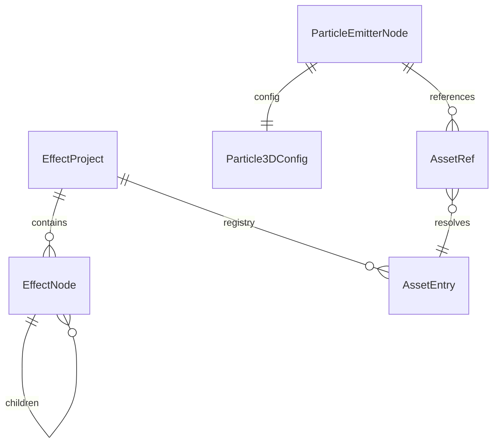

# FX Studio 2.0 产品需求文档（PRD）

| 字段 | 内容 |
|------|------|
| 产品名称 | FX Studio（特效工坊） |
| 文档版本 | **v2.0-draft** |
| 最后更新 | 2026-07-23 |
| 目标引擎 | Cocos Creator 3.8.x（当前一等公民）；Unity、Unreal（导出路线图） |
| 上一版本 | [PRD.md v1.1](./PRD.md) |

---

## 1. 产品定位重塑

### 1.0 终极目标

> **做一款最好用的特效制作软件，让用户在此完成创作与预览后，可将特效导出到 Cocos Creator / Unity / Unreal 中直接使用。**

| 维度 | 说明 |
|------|------|
| 体验 | 编辑工作流对标 Unity Particle System，追求「最好用」的手感与效率 |
| 产出 | 特效资源（Prefab / 粒子系统 / 材质贴图等）可在目标引擎内开箱即用 |
| 引擎 | **Cocos Creator 3.8** — 当前完整支持；**Unity / Unreal** — 后续版本扩展导出 |

### 1.1 变更背景

v1.x 以「AI 对话生成」为主入口，存在以下结构性问题：

| 问题 | 现状 | 用户期望 |
|------|------|----------|
| 特效结构扁平 | 1 Session = 1 粒子系统，无法组合 | 复杂特效 = 多个子特效（爆炸+烟雾+光晕） |
| 历史面板价值低 | 仅 AI 生成后快照，手动编辑不记录 | 用 Undo/Redo 替代版本历史 |
| 资产不可见 | 贴图固定导出 `particle-circle.png` | 贴图/Shader/模型可引用、可替换 |
| 无资产库 | 无统一资源管理 | 内置基础资产 + 拖拽替换 |
| AI 喧宾夺主 | 左栏默认「对话」，工具栏 AI 痕迹重 | **先通用编辑器，后 AI 辅助** |

### 1.2 新定位

> **FX Studio 是一款面向游戏引擎的通用粒子特效编辑器：在此完成层级化组合、资产管理与实时预览，并导出为 Cocos / Unity / Unreal 可直接使用的特效资源；AI 作为可选辅助能力，用于快速生成初稿与语义微调。**

### 1.3 设计原则

1. **最好用优先**：布局、快捷键、工作流对标 Unity Particle System，持续打磨编辑体验
2. **组合而非扁平**：项目 → 特效组 → 子特效（Emitter）→ 模块
3. **引用可追溯**：所有外部资源以 AssetRef 形式存在 IR 中，Inspector 可点选替换
4. **AI 可关闭**：无 API Key 时仍是完整可用的手动编辑器
5. **多引擎导出**：组合特效可导出为目标引擎原生格式；当前 Cocos 多节点 Prefab 已落地，Unity / Unreal 按路线图推进

---

## 2. 目标用户与场景

### 2.1 核心用户（优先级上调）

| 角色 | 场景 |
|------|------|
| TA / 特效美术 | 手动搭组合爆炸、魔法、环境特效，替换贴图与材质 |
| Cocos 工程师 | 导入 prefab 改造、导出回项目，资产路径一致 |
| 独立开发者 | 用内置资产库快速出效果，可选 AI 加速 |

### 2.2 AI 用户（优先级下调，保留）

| 角色 | 场景 |
|------|------|
| 策划 / 非美术 | 描述需求 → AI 生成初稿 → 手动精修 |

---

## 3. 信息架构（v2.0 布局）

```
┌──────────────────────────────────────────────────────────────────────────┐
│ 菜单栏：文件 | 编辑 | 资产 | 视图 | 工具 | 帮助                            │
│ 工具栏：新建 | 打开 | 保存 | 撤销/重做 | 播放 | 导入 | 导出 | AI助手(可选) │
├──────────┬─────────────────────────────────────────────┬─────────────────┤
│ 层级树    │              中央工作区                       │   属性检查器     │
│ (Scene)  │  ┌───────────────────────────────────────┐  │                 │
│          │  │ 视窗：预览 / 节点图（可 Tab 切换）        │  │  Transform      │
│ 项目     │  └───────────────────────────────────────┘  │  模块参数        │
│ └─特效组  │  ┌───────────────────────────────────────┐  │  资产引用槽       │
│   └─子特效│  │ 时间轴（可选，v2.2）                    │  │  (贴图/材质/网格) │
│     └─模块│  └───────────────────────────────────────┘  │                 │
├──────────┴─────────────────────────────────────────────┴─────────────────┤
│ 资产浏览器 (Asset Browser) — 可 dock 底部或右侧                           │
│ [内置] 贴图 | 材质 | Shader | 模型  |  [项目] 用户导入资产                  │
└──────────────────────────────────────────────────────────────────────────┘
│ 状态栏：项目名 | 选中对象 | 粒子数 | 引擎目标 | 就绪                        │
└──────────────────────────────────────────────────────────────────────────┘
```

### 3.1 面板变更对照

| v1.x | v2.0 | 说明 |
|------|------|------|
| 对话（默认左栏 Tab） | **AI 助手**（可折叠/可隐藏） | 非主入口 |
| 特效树（Session 列表） | **层级树（Scene Hierarchy）** | 单项目内多子特效 |
| 历史 | **移除** | 由 Undo/Redo 替代 |
| 模板库（弹窗） | 并入 **资产浏览器 / 预设** 分类 | |
| 无 | **资产浏览器** | 新增 P0 |
| Inspector | Inspector + **资产引用槽** | 扩展 |

---

## 4. 功能需求

### 4.1 复合特效结构树（P0）

#### 4.1.1 概念模型

```
EffectProject（项目文件 .fxproj）
└── root: EffectGroupNode（根组）
    ├── transform: { position, rotation, scale }
    ├── children: EffectNode[]
    │   ├── ParticleEmitterNode（子特效 / 发射器）
    │   │   ├── transform
    │   │   ├── enabled, solo, name
    │   │   ├── config: Particle3DConfig（现有 11 模块）
    │   │   └── assetRefs: { mainTexture, material, mesh? }
    │   ├── EffectGroupNode（嵌套组，如「爆炸_主体」）
    │   └── （v2.2）LightNode / AudioNode 预留
    └── projectSettings: { targetEngine, exportPath }
```

#### 4.1.2 功能清单

| 编号 | 需求 | 验收标准 |
|------|------|----------|
| F-HIER-01 | 层级树展示项目内所有节点 | 支持组 / 粒子发射器 / 模块（展开） |
| F-HIER-02 | 新增子特效 | 右键 → 添加粒子系统，默认命名「Particle System N」 |
| F-HIER-03 | 新增组 | 右键 → 添加空组，可拖拽归类 |
| F-HIER-04 | 拖拽排序与 reparent | 拖放改变父子关系，Undo 可恢复 |
| F-HIER-05 | 节点 Transform | Inspector 编辑 position/rotation/scale，预览同步 |
| F-HIER-06 | 单节点 Solo / 隐藏 | 眼睛图标隐藏；Solo 仅显示选中发射器 |
| F-HIER-07 | 复制 / 粘贴 /  duplicate | Ctrl+D 复制子特效 |
| F-HIER-08 | 多选 | Shift 多选，批量启禁 |
| F-HIER-09 | 预览合成 | 所有可见发射器同屏播放 |
| F-HIER-10 | 导出多节点 Prefab | Cocos 根节点下 N 个 ParticleSystem 子节点 |

#### 4.1.3 与现有模块树的关系

- **层级树一级**：场景对象（Emitter / Group）
- **层级树二级（展开 Emitter）**：11 个粒子模块（沿用 v1 `modules.ts`）
- **节点编辑器**：从「单特效模块图」改为「可选：当前 Emitter 模块图」，或合并入 Inspector

---

### 4.2 移除历史窗口，建立编辑历史体系（P0）

| 编号 | 需求 | 说明 |
|------|------|------|
| F-EDIT-01 | 移除「历史」Tab | UI 删除 VersionHistoryPanel |
| F-EDIT-02 | 全局 Undo/Redo | Ctrl+Z / Ctrl+Y，覆盖 Inspector、树操作、资产替换 |
| F-EDIT-03 | 命令栈 | 基于 immutable patch 或 JSON snapshot diff |
| F-EDIT-04 | 自动保存 | 项目级自动保存（debounce 30s），非「版本历史」 |
| F-EDIT-05 | 可选：本地快照 | 文件 → 保存快照（整个 .fxproj），替代会话内版本列表 |

**不再做**：Session 内 50 条 AI 版本链。

---

### 4.3 资产引用系统（P0）

#### 4.3.1 AssetRef 模型

```typescript
interface AssetRef {
  id: string;              // 项目内唯一 ID
  assetId: string;         // 指向 AssetRegistry 中的资产
  type: 'texture' | 'material' | 'shader' | 'mesh' | 'spriteFrame';
  label?: string;          // 显示名
}

interface AssetEntry {
  id: string;
  name: string;
  type: AssetType;
  source: 'builtin' | 'project' | 'imported';
  uri: string;             // 相对项目路径或 builtin:// 前缀
  meta?: { width, height, uuid?, cocosMeta? };
}
```

#### 4.3.2 引用槽位（Inspector）

| 模块 | 槽位 | 行为 |
|------|------|------|
| rendererModule | Main Texture | 缩略图 + 文件名 + 清除/替换 |
| rendererModule | Material | 材质资产（builtin-particle 或自定义） |
| rendererModule | Mesh | RenderMode=Mesh 时启用 |
| textureAnimation | Sheet Texture | 序列帧图集 |
| trailModule | Trail Texture | 拖尾贴图 |
| （全局） | Shader | Shader 资产引用（Shader 模式） |

#### 4.3.3 功能清单

| 编号 | 需求 | 验收标准 |
|------|------|----------|
| F-REF-01 | Inspector 资产槽 UI | 拖拽资产浏览器条目到槽位即替换 |
| F-REF-02 | 预览使用真实贴图 | 替换后立即在 WebGL 预览中生效 |
| F-REF-03 | 导出保留引用 | 导出 png/mtl/meta，prefab UUID 指向正确 |
| F-REF-04 | 导入恢复引用 | 从 Cocos prefab 导入时解析 `_mainTexture` UUID |
| F-REF-05 | 缺失资产提示 | 黄色警告 + 回退默认贴图 |
| F-REF-06 | 项目资产文件夹 | `{project}/assets/` 与 .fxproj 同级管理 |

---

### 4.4 资产浏览器（P0）

#### 4.4.1 分类结构

```
资产浏览器
├── 📁 内置库 (read-only)
│   ├── 贴图/
│   │   ├── particle-circle（默认圆点）
│   │   ├── particle-soft-glow
│   │   ├── particle-smoke-sheet
│   │   ├── particle-spark
│   │   └── particle-star
│   ├── 材质/
│   │   ├── builtin-particle（默认）
│   │   ├── additive-particle
│   │   └── alpha-blended-particle
│   ├── Shader/
│   │   ├── builtin-particle.effect（只读参考）
│   │   └── additive-soft.shadergraph（v2.2）
│   └── 模型/
│       ├── quad-billboard.fbx
│       └── cone-mesh.fbx
└── 📁 项目资产 (read-write)
    └── 用户导入的 png / fbx / mtl ...
```

#### 4.4.2 功能清单

| 编号 | 需求 | 验收标准 |
|------|------|----------|
| F-ASSET-01 | 资产浏览器面板 | 网格/列表视图，缩略图 |
| F-ASSET-02 | 内置资产包 | 首包 ≥10 张贴图、3 材质、2 模型 |
| F-ASSET-03 | 导入资产 | 拖入 png/fbx → 进入项目资产 |
| F-ASSET-04 | 拖拽到 Inspector | 替换当前选中槽位 |
| F-ASSET-05 | 拖拽到层级树 | 创建带该贴图的新 Emitter |
| F-ASSET-06 | 搜索与过滤 | 按名称、类型筛选 |
| F-ASSET-07 | 预览弹窗 | 双击资产：大图/Shader 源码/Mesh 线框 |
| F-ASSET-08 | 删除与重命名 | 仅项目资产可操作 |

---

### 4.5 AI 助手降级（P1）

| 编号 | 需求 | 说明 |
|------|------|------|
| F-AI-01 | AI 面板默认折叠 | 首次打开不显示对话 |
| F-AI-02 | 工具栏「AI 助手」Toggle | 显式打开，非 Tab 竞争 |
| F-AI-03 | AI 作用域 | 仅对**当前选中的 Emitter** 生成/微调 |
| F-AI-04 | 组合特效 AI（P2） | 「添加一个烟雾子特效」→ 在层级树新建节点 |

---

### 4.6 项目与文件（P0）

| 编号 | 需求 | 说明 |
|------|------|------|
| F-PROJ-01 | .fxproj 项目格式 | JSON，含 hierarchy + assetRegistry + settings |
| F-PROJ-02 | 新建 / 打开 / 保存 | 替代多 Session localStorage 模式 |
| F-PROJ-03 | 最近项目列表 | 启动页或文件菜单 |
| F-PROJ-04 | 迁移工具 | v1 Session → v2 .fxproj 单 Emitter 项目 |

---

### 4.7 导出升级（P0）

| 编号 | 需求 | 说明 |
|------|------|------|
| F-EXP-01 | 多 Emitter 导出 | 单 prefab 多 ParticleSystem 子节点 |
| F-EXP-02 | 资产打包 | 仅导出项目引用到的 png/mtl/meta |
| F-EXP-03 | Transform 导出 | 子节点 `_lpos/_lrot/_lscale` 对应层级树 |
| F-EXP-04 | 组节点导出 | 空组 → 空 Node 容器 |

---

## 5. 数据模型（v2.0 IR）

### 5.1 核心实体关系



### 5.2 文件格式示例（.fxproj 摘要）

```json
{
  "version": "2.0.0",
  "name": "Explosion",
  "targetEngine": "cocos-creator-3.8",
  "assetRegistry": [
    { "id": "tex-circle", "name": "particle-circle", "type": "texture", "source": "builtin", "uri": "builtin://textures/particle-circle.png" }
  ],
  "root": {
    "type": "group",
    "name": "Root",
    "transform": { "position": [0,0,0], "rotation": [0,0,0], "scale": [1,1,1] },
    "children": [
      {
        "type": "emitter",
        "name": "Flash",
        "transform": { "position": [0,0,0], "rotation": [0,0,0], "scale": [1,1,1] },
        "config": { "...Particle3DConfig" },
        "assetRefs": { "mainTexture": "tex-circle" }
      },
      {
        "type": "emitter",
        "name": "Smoke",
        "transform": { "position": [0,0.5,0], "rotation": [0,0,0], "scale": [1,1,1] },
        "config": { "...Particle3DConfig" },
        "assetRefs": { "mainTexture": "tex-smoke" }
      }
    ]
  }
}
```

### 5.3 与 v1 EffectConfig 兼容

- `Particle3DConfig` **保留**，作为 `ParticleEmitterNode.config`
- v1 `Session` / `EffectConfig` 废弃，由 `EffectProject` 替代
- 提供 `migrateV1SessionToProject(session)` 一次性迁移

---

## 6. 非功能需求

| 类别 | 要求 |
|------|------|
| 性能 | 5 个 Emitter × 200 粒子，预览 ≥ 30 FPS |
| 资产 | 内置库总大小 < 5MB（压缩 PNG） |
| 可扩展 | AssetRegistry 插件点，后续支持 Spine / 序列帧文件夹 |
| 测试 | 多节点导出单测 + 资产引用 round-trip 测试 |

---

## 7. 版本里程碑

| 版本 | 主题 | 交付物 |
|------|------|--------|
| **v2.0-alpha** | 结构重构 | 层级树 + .fxproj + 移除历史 + Undo |
| **v2.0-beta** | 资产系统 | 资产浏览器 + 引用槽 + 导出打包 |
| **v2.0** | 正式版 | 多 Emitter 导出 + 迁移 + 文档 |
| **v2.1** | AI 适配 | AI 针对选中 Emitter；组合生成 |
| **v2.2** | 扩展 | Shader 资产编辑；Mesh 渲染模式完整支持 |

---

## 8. 风险与决策

| 决策 | 选择 | 理由 |
|------|------|------|
| Session vs Project | **Project 文件** | 复合特效需单文件描述整棵树 |
| 节点图 vs 层级树 | **层级树为主**，节点图可选 | 组合特效以层级为准，模块图保留为 Emitter 内部视图 |
| 历史 vs Undo | **Undo** | 符合通用 DCC 工具习惯 |
| 内置资产存储 | `public/assets/builtin/` + 打包进 Electron | 离线可用 |
| 2D/Shader/Animation | v2.0 仅粒子；其他类型 v2.2 纳入 AssetRef | 控制范围 |

---

## 9. 成功指标（v2.0）

| 指标 | 目标 |
|------|------|
| 组合爆炸特效（3  Emitter）搭建时间 | < 15 分钟（纯手动） |
| 贴图替换到预览生效 | < 1 秒 |
| 多节点 Prefab Cocos 导入 | 100% 可播放 |
| AI 面板关闭时功能完整度 | 100%（无 AI 亦可完成全流程） |
| v1 用户项目迁移 | 一键迁移无数据丢失 |

---

## 10. 附录：v1 → v2 功能映射

| v1 功能 | v2 去向 |
|---------|---------|
| Session 列表 | → 最近项目 + 单项目层级树 |
| VersionHistoryPanel | → 删除，Undo/Redo |
| ChatPanel 默认 Tab | → AI 助手（可选） |
| EffectTreePanel | → HierarchyPanel |
| TemplateLibrary | → 资产浏览器「预设」+ 内置模板 |
| 固定 particle-circle 导出 | → AssetRef 驱动导出 |
| NodeEditor 模块图 | → Emitter 选中时显示（Inspector 旁或 Tab） |

---

## 变更记录

| 版本 | 日期 | 变更 |
|------|------|------|
| v2.0-draft | 2026-07-23 | 明确终极目标：最好用特效工具 + Cocos/Unity/Unreal 多引擎导出 |
| v2.0-draft | 2026-07-23 | 基于用户反馈：组合特效、资产系统、编辑器优先、移除历史 |
