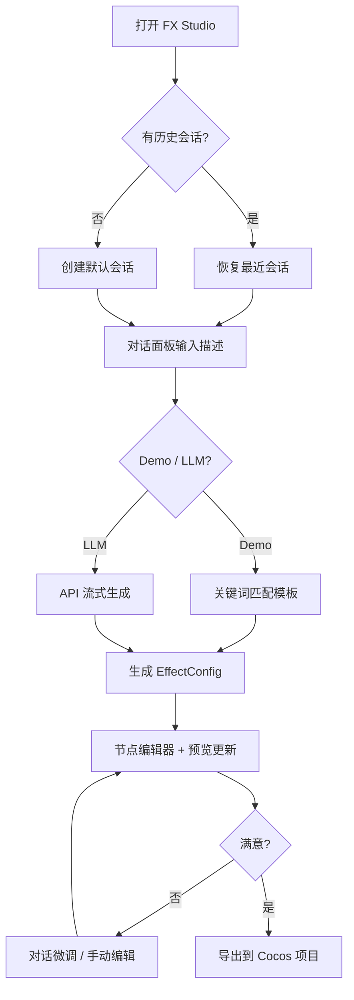

# FX Studio 产品需求文档（PRD）

| 字段 | 内容 |
|------|------|
| 产品名称 | FX Studio（特效工坊） |
| 包名 | cocos-effect-generator |
| 文档版本 | v1.1 |
| 最后更新 | 2026-07-22 |
| 目标引擎 | Cocos Creator 3.8.x（主），Unity 2022+ / Godot 4.x（辅助导出） |
| 产品形态 | Electron 桌面应用 + Web 开发预览 |

---

## 1. 产品概述

### 1.1 背景

游戏特效制作（尤其是粒子系统） traditionally 需要美术/TA 在引擎编辑器中手动调参，学习曲线陡峭、迭代效率低。FX Studio 通过 **AI 自然语言生成 + 可视化编辑 + 实时预览 + 一键导出**，降低特效创作门槛，缩短从创意到可用资源的链路。

### 1.2 产品定位

> **AI 驱动的游戏粒子特效创作工具**，以 Cocos Creator 3.8 为一等公民，提供类引擎编辑器的创作体验。

### 1.3 核心价值

| 价值点 | 描述 |
|--------|------|
| 降本增效 | 自然语言描述即可生成可用特效初稿 |
| 所见即所得 | Three.js 实时 WebGL 预览，支持 3D/2D 粒子 |
| 引擎兼容 | 导出 Cocos Creator `.prefab` 原生格式 |
| 可深度编辑 | 节点图 + 属性检查器双轨编辑 |
| 资产复用 | 15 个内置模板 + 自定义模板保存 |

### 1.4 产品边界

**包含：**

- 3D/2D 粒子特效的 AI 生成与手动编辑
- Shader 代码编辑（GLSL 高亮）
- 动画编辑器（基础）
- `.prefab` 导入/导出
- 多特效项目管理与会话持久化

**不包含（当前版本）：**

- 完整的 3D 场景编辑
- 粒子纹理绘制工具
- 团队协作 / 云同步
- 移动端独立 App

---

## 2. 目标用户

### 2.1 用户画像

| 角色 | 特征 | 核心诉求 |
|------|------|----------|
| 独立游戏开发者 | 全栈开发，特效能力有限 | 快速出效果、能导入 Cocos 项目 |
| Cocos 客户端工程师 | 熟悉 Creator，希望加速原型 | AI 生成初稿 + 精确参数微调 |
| 游戏美术/TA | 有特效经验，追求效率 | 模板库起步、可视化曲线编辑 |
| 技术策划 | 需要验证玩法视觉效果 | Demo 模式零配置试用 |

### 2.2 使用场景

1. **从零创作**：在对话面板输入「火焰特效」，AI 生成配置并在预览区实时播放
2. **模板起步**：从模板库选择「雪花飘落」，在此基础上微调
3. **导入改造**：拖入已有 `.prefab`，在工具内修改后重新导出
4. **多特效并行**：同时维护多个特效项目，通过特效树切换
5. **跨引擎协作**：导出 Unity `.prefab` 文本或 Godot 配置供参考

---

## 3. 产品目标与成功指标

### 3.1 业务目标

- 将单个简单粒子特效的制作时间从 **30+ 分钟** 缩短至 **5 分钟以内**（含 AI 生成 + 微调）
- 生成结果 **可直接导入** Cocos Creator 3.8 项目使用，无需手工重建节点

### 3.2 成功指标（KPI）

| 指标 | 目标 |
|------|------|
| Demo 模式首次生成成功率 | ≥ 90%（匹配 15 个内置模板关键词） |
| 预览帧率 | ≥ 30 FPS（500 粒子以内） |
| 导出文件 Cocos 导入成功率 | 100%（标准模块） |
| 会话数据持久化 | 对话/配置切换不丢失 |
| 崩溃率 | < 0.1%（桌面版） |

---

## 4. 信息架构

### 4.1 整体布局

```
┌─────────────────────────────────────────────────────────────────┐
│  工具栏：新建 | 导入 | 保存 | 模板库 | 类型 | 预览 | 导出 | 设置  │
├──────────┬──────────────────────────────────────┬──────────────┤
│ 左侧面板  │           中央工作区                   │  属性检查器   │
│          │  ┌────────────────────────────────┐  │              │
│ Tab:     │  │ 节点编辑器 / Shader / 动画      │  │  模块参数     │
│ · 对话   │  └────────────────────────────────┘  │  渐变/曲线    │
│ · 特效   │  ┌────────────────────────────────┐  │  编辑         │
│ · 历史   │  │ 实时预览（可折叠、可拖拽高度）    │  │              │
│          │  └────────────────────────────────┘  │              │
├──────────┴──────────────────────────────────────┴──────────────┤
│  状态栏：特效名 | 类型 | Demo/LLM 模式 | 就绪/生成中               │
└─────────────────────────────────────────────────────────────────┘
```

### 4.2 面板规格

| 区域 | 默认宽度/高度 | 可调范围 | 持久化 |
|------|--------------|----------|--------|
| 左侧面板 | 300px | 200–560px | localStorage |
| 右侧面板 | 280px | 200–560px | localStorage |
| 预览区 | 280px 高 | 120–520px | localStorage |

---

## 5. 功能需求

### 5.1 AI 对话生成

**优先级：P0**

| 编号 | 需求 | 描述 | 状态 |
|------|------|------|------|
| F-AI-01 | Demo 模式 | 无 API Key 即可使用，基于关键词匹配 15 个内置模板 | ✅ 已实现 |
| F-AI-02 | LLM 模式 | 配置 OpenAI / Anthropic API Key 后启用真正的 AI 生成 | ✅ 已实现 |
| F-AI-03 | 流式输出 | LLM 回复流式显示，带 Markdown 渲染 | ✅ 已实现 |
| F-AI-04 | 语义微调 | 支持「更快」「更亮」「更多」等自然语言微调当前特效 | ✅ 已实现 |
| F-AI-05 | 欢迎引导 | 新会话自动展示 Demo 关键词引导 | ✅ 已实现 |
| F-AI-06 | 对话持久化 | 切换特效/重启后保留对话记录 | ✅ 已实现 |

**Demo 模式支持的关键词示例：**

- 火焰 / 雪花 / 下雨 / 烟雾 / 爆炸 / 魔法星光
- 冲击波 / 火花 / 灰尘 / 治愈光环 / 暗影 / 冰霜 / 萤火虫 / 能量场 / 传送门

**LLM 配置项：**

- 服务商：OpenAI / Anthropic
- 模型：GPT-4o、GPT-4o Mini、Claude 3.5 Sonnet
- Temperature、Max Tokens

---

### 5.2 特效总览（特效树）

**优先级：P0**

| 编号 | 需求 | 描述 | 状态 |
|------|------|------|------|
| F-TREE-01 | 树形结构 | 一级：特效项目；二级：粒子模块列表 | ✅ 已实现 |
| F-TREE-02 | 切换特效 | 点击特效节点切换当前编辑上下文 | ✅ 已实现 |
| F-TREE-03 | 选中模块 | 点击模块节点，右侧属性面板定位并高亮 | ✅ 已实现 |
| F-TREE-04 | 搜索过滤 | 按特效名称搜索 | ✅ 已实现 |
| F-TREE-05 | 右键菜单 | 特效：打开/重命名/复制/展开/删除；模块：选中/启禁/复制名 | ✅ 已实现 |
| F-TREE-06 | 新建特效 | 顶部「+ 新建」按钮 | ✅ 已实现 |

---

### 5.3 节点编辑器

**优先级：P0**

| 编号 | 需求 | 描述 | 状态 |
|------|------|------|------|
| F-NODE-01 | 模块节点图 | 10 个粒子模块以节点形式展示，主模块为中心 | ✅ 已实现 |
| F-NODE-02 | 单击选中 | 单击节点 → 选中模块，联动属性检查器 | ✅ 已实现 |
| F-NODE-03 | 双击启禁 | 双击节点 → 切换模块 ON/OFF | ✅ 已实现 |
| F-NODE-04 | 拖拽布局 | 节点可自由拖动，位置持久化到 `metadata.nodeLayout` | ✅ 已实现 |
| F-NODE-05 | 锁定画布 | 控件区提供锁定按钮，禁止拖动/连接 | ✅ 已实现 |
| F-NODE-06 | 缩放控件 | 放大/缩小/适应视图 | ✅ 已实现 |
| F-NODE-07 | 小地图 | MiniMap 总览节点布局 | ✅ 已实现 |

**模块列表（10 个）：**

主模块、发射器形状、颜色、大小、旋转、速度、噪声、拖尾、纹理动画、渲染器

---

### 5.4 属性检查器

**优先级：P0**

| 编号 | 需求 | 描述 | 状态 |
|------|------|------|------|
| F-INS-01 | 分模块折叠 | 每个模块独立 Section，可展开/折叠 | ✅ 已实现 |
| F-INS-02 | 模块启禁 | Section 标题栏 ON/OFF 开关 | ✅ 已实现 |
| F-INS-03 | 主模块参数 | 时长、容量、速度、发射率、重力、循环、初始颜色 | ✅ 已实现 |
| F-INS-04 | 形状参数 | 锥/球/半球/盒/圆，半径、角度 | ✅ 已实现 |
| F-INS-05 | 渐变编辑 | 颜色模块支持多关键帧 + 取色器 + 透明度 | ✅ 已实现 |
| F-INS-06 | 曲线编辑 | 大小/旋转/速度模块支持关键帧曲线 | ✅ 已实现 |
| F-INS-07 | 爆发配置 | Bursts 列表展示与添加 | ✅ 已实现 |
| F-INS-08 | 选中高亮 | 与节点编辑器/特效树联动，自动滚动定位 | ✅ 已实现 |

---

### 5.5 实时预览

**优先级：P0**

| 编号 | 需求 | 描述 | 状态 |
|------|------|------|------|
| F-PREV-01 | 3D 预览 | Three.js 透视相机，支持鼠标旋转/缩放 | ✅ 已实现 |
| F-PREV-02 | 2D 预览 | 正交相机，适用于 2D 粒子 | ✅ 已实现 |
| F-PREV-03 | 播放控制 | 播放/暂停/重置，空格键快捷切换 | ✅ 已实现 |
| F-PREV-04 | 背景切换 | 深灰/中灰/蓝灰/透明，同步 Three.js 场景 | ✅ 已实现 |
| F-PREV-05 | 坐标轴 | Unity 风格右下角 XYZ 坐标指示器 | ✅ 已实现 |
| F-PREV-06 | 实时同步 | 参数修改后预览即时更新 | ✅ 已实现 |
| F-PREV-07 | 网格地面 | GridHelper 辅助空间感知 | ✅ 已实现 |

---

### 5.6 模板库

**优先级：P1**

| 编号 | 需求 | 描述 | 状态 |
|------|------|------|------|
| F-TPL-01 | 内置模板 | 15 个预设，4 大分类 | ✅ 已实现 |
| F-TPL-02 | 分类筛选 | 自然现象 / 战斗特效 / 魔法技能 / 环境氛围 | ✅ 已实现 |
| F-TPL-03 | 一键应用 | 选中模板后直接加载到当前特效 | ✅ 已实现 |
| F-TPL-04 | 自定义模板 | 工具栏「保存」将当前特效存为自定义模板 | ✅ 已实现 |
| F-TPL-05 | 自定义模板存储 | localStorage `cocos-custom-templates` | ✅ 已实现 |

**内置模板清单（15 个）：**

| 分类 | 模板 |
|------|------|
| 自然现象 | 火焰、雪花飘落、下雨、烟雾 |
| 战斗特效 | 爆炸、冲击波、火花飞溅、灰尘扬起 |
| 魔法技能 | 魔法星光、治愈光环、暗影能量、冰霜爆发 |
| 环境氛围 | 萤火虫、能量场、传送门 |

---

### 5.7 导入与导出

**优先级：P0**

| 编号 | 需求 | 描述 | 状态 |
|------|------|------|------|
| F-IO-01 | Prefab 导入 | 工具栏按钮 + 拖拽 `.prefab` 文件 | ✅ 已实现 |
| F-IO-02 | Cocos 导出 | 导出为 Cocos Creator 3.8 兼容 `.prefab` | ✅ 已实现 |
| F-IO-03 | 项目路径 | Electron 原生目录选择器 | ✅ 已实现 |
| F-IO-04 | Unity 导出 | 导出 Unity ParticleSystem 配置文本 | ✅ 已实现 |
| F-IO-05 | Godot 导出 | 导出 Godot GPUParticles3D 配置 | ✅ 已实现 |
| F-IO-06 | 兼容性报告 | 非 Cocos 引擎导出前展示模块兼容状态 | ✅ 已实现 |

---

### 5.8 版本历史

**优先级：P2**

| 编号 | 需求 | 描述 | 状态 |
|------|------|------|------|
| F-VER-01 | 自动保存 | AI 生成后自动保存版本快照（最多 50 个） | ✅ 已实现 |
| F-VER-02 | 版本恢复 | 点击历史版本一键回滚 | ✅ 已实现 |
| F-VER-03 | 版本列表 | 左侧面板「历史」Tab 展示 | ✅ 已实现 |

---

### 5.9 Shader 编辑器

**优先级：P2**

| 编号 | 需求 | 描述 | 状态 |
|------|------|------|------|
| F-SHD-01 | GLSL 编辑 | CodeMirror 6 语法高亮 | ✅ 已实现 |
| F-SHD-02 | 类型切换 | 工具栏切换至 Shader 模式 | ✅ 已实现 |

---

### 5.10 动画编辑器

**优先级：P2**

| 编号 | 需求 | 描述 | 状态 |
|------|------|------|------|
| F-ANI-01 | 动画编辑 | 基础动画编辑界面 | ✅ 已实现 |
| F-ANI-02 | 类型切换 | 工具栏切换至动画模式 | ✅ 已实现 |

---

### 5.11 设置与系统

**优先级：P1**

| 编号 | 需求 | 描述 | 状态 |
|------|------|------|------|
| F-SYS-01 | AI 设置弹窗 | API Key / 模型 / 温度 / Token 上限 | ✅ 已实现 |
| F-SYS-02 | 快捷键 | Ctrl+E 导出、Ctrl+, 设置、Ctrl+T 模板库、Space 播放 | ✅ 已实现 |
| F-SYS-03 | 状态栏 | 特效名、类型、模式、生成状态 | ✅ 已实现 |
| F-SYS-04 | Toast 提示 | 操作反馈（保存、导出、删除等） | ✅ 已实现 |
| F-SYS-05 | 国际化预留 | i18n 中英文文案框架 | ✅ 已实现 |
| F-SYS-06 | 应用图标 | PNG + SVG 双格式，Electron 窗口 + 工具栏显示 | ✅ 已实现 |

---

## 6. 数据模型

### 6.1 核心实体

```
EffectConfig（特效配置 - 统一中间表示 IR）
├── id, name, type, version
├── targetEngineVersion
├── source: ai-generated | template | manual | imported
├── tags[]
├── metadata
│   ├── author, description
│   ├── createdAt, updatedAt
│   └── nodeLayout: Record<moduleKey, {x, y}>  // 节点编辑器布局
└── config: Particle3DConfig | Particle2DConfig

Session（特效会话）
├── id, name
├── effect: EffectConfig
├── messages: ChatMessage[]
├── versionHistory: EffectConfig[]  // 最多 50 条
├── createdAt, updatedAt
└── 持久化：localStorage（最多 20 个会话）

ChatMessage
├── id, role: user | assistant | system
├── content, timestamp
```

### 6.2 粒子模块结构（Particle3DConfig）

| 模块 | 关键字段 |
|------|----------|
| mainModule | duration, capacity, loop, startLifetime, startSpeed, startSize3D, startColor, gravityModifier, rateOverTime, bursts |
| shapeModule | enabled, shapeType, radius, angle, arc, emitFrom |
| colorOverLifetime | enabled, color (GradientConfig) |
| sizeOverLifetime | enabled, size (CurveConfig) |
| rotationOverLifetime | enabled, rotation (CurveConfig) |
| velocityOverLifetime | enabled, velocityX/Y/Z (CurveConfig) |
| noiseModule | enabled, strength, frequency, scrollSpeed, octaves |
| trailModule | enabled, ratio, lifetime |
| textureAnimation | enabled, numTilesX/Y |
| rendererModule | renderMode |

---

## 7. 用户流程

### 7.1 主流程：AI 生成特效



### 7.2 辅助流程：模板应用

```
打开模板库 → 选择分类 → 点击模板 → 加载到当前会话 → 预览 → 微调 → 导出
```

### 7.3 辅助流程：Prefab 导入改造

```
拖拽 .prefab 到主窗口 → 解析为 EffectConfig → 编辑 → 重新导出
```

---

## 8. 交互规范

### 8.1 节点编辑器

| 操作 | 行为 |
|------|------|
| 单击节点 | 选中模块，属性面板高亮定位 |
| 双击节点 | 切换模块启用/禁用 |
| 拖拽节点 | 自由移动，松手后保存布局 |
| 锁定按钮 | 禁止节点拖动和连接 |

### 8.2 特效树

| 操作 | 行为 |
|------|------|
| 左键点击特效 | 切换当前编辑特效 |
| 左键点击模块 | 选中模块 |
| 右键点击特效 | 上下文菜单（打开/重命名/复制/展开/删除） |
| 右键点击模块 | 上下文菜单（选中/启禁/复制名） |

### 8.3 快捷键

| 快捷键 | 功能 |
|--------|------|
| `Ctrl+E` | 打开导出弹窗 |
| `Ctrl+,` | 打开设置 |
| `Ctrl+T` | 打开模板库 |
| `Space` | 预览播放/暂停 |
| `Esc` | 关闭弹窗 |

---

## 9. 非功能需求

### 9.1 性能

| 项目 | 要求 |
|------|------|
| 3D 预览粒子上限 | 500（硬限制） |
| 首屏加载 | < 3s（桌面版） |
| AI Demo 响应 | < 500ms |
| 面板拖拽 | 无抖动，增量更新 |

### 9.2 兼容性

| 环境 | 支持 |
|------|------|
| Windows 10+ | ✅ 主要目标平台 |
| macOS | ✅ Electron 跨平台 |
| Web 浏览器 | ✅ 开发预览（部分 Electron API 降级） |
| WebGL | 预览必需，不支持时展示降级提示 |

### 9.3 数据安全

- API Key 存储在 Electron 主进程内存（生产环境应加密）
- 会话数据仅存 localStorage，不上传云端
- 不上传用户特效资产

### 9.4 可用性

- 深色主题，统一 `--header-height: 40px` 面板规格
- 所有主要操作有 Tooltip 或 Toast 反馈
- 输入框聚焦时不触发全局快捷键

---

## 10. 技术架构

### 10.1 技术栈

| 层级 | 技术 |
|------|------|
| 桌面壳 | Electron 32 |
| 前端框架 | React 18 + TypeScript 5 |
| 构建 | Vite 5 + vite-plugin-electron |
| 状态管理 | Zustand 5 |
| 3D 渲染 | Three.js 0.169 |
| 节点图 | @xyflow/react 12 |
| 代码编辑 | CodeMirror 6 |
| AI SDK | OpenAI SDK + Anthropic SDK |
| 测试 | Vitest |

### 10.2 目录结构

```
src/
├── components/
│   ├── chat/           # AI 对话
│   ├── editor/         # 节点/Shader/动画编辑器
│   ├── inspector/      # 属性检查器 + 渐变/曲线编辑
│   ├── preview/        # 预览面板 + 坐标轴
│   ├── templates/      # 模板库
│   └── layout/         # 特效树/设置/导出/拖拽/右键菜单
├── stores/             # app-store / session-store
├── types/              # EffectConfig 类型定义
├── utils/              # AI引擎/预览/导入导出
├── constants/          # 模块定义
├── hooks/              # 快捷键/Prefab导入
└── data/               # 15 个内置模板
electron/
└── main.ts             # 主进程 + IPC + AI 流式
```

### 10.3 关键数据流

```
用户输入 → ChatPanel → ai-engine → EffectConfig
                                    ↓
              session-store ← updateEffectConfig
                    ↓
    NodeEditor / InspectorPanel / PreviewPanel（响应式更新）
                    ↓
              export-pipeline → .prefab 文件
```

---

## 11. 版本规划

### v1.0（当前）— 核心闭环 ✅

- AI Demo/LLM 双模式生成
- 节点编辑 + 属性检查 + 实时预览
- Cocos Prefab 导入/导出
- 模板库 + 特效树 + 会话管理

### v1.1（近期）— 体验打磨

- [ ] LLM 模式生成质量优化与 JSON 校验
- [ ] 2D 粒子完整编辑链路
- [ ] Shader 编辑器与预览联动
- [ ] 动画编辑器时间轴完善
- [ ] 撤销/重做（Undo/Redo）

### v1.2（中期）— 生态扩展

- [ ] 粒子纹理库 / 内置素材
- [ ] 批量导出
- [ ] 特效预览 GIF/视频录制
- [ ] Cocos 插件一键部署

### v2.0（远期）— 协作与智能

- [ ] 云端模板市场
- [ ] 团队项目共享
- [ ] 多模态输入（参考图 → 特效）
- [ ] 特效性能分析（Overdraw / 粒子数警告）

---

## 12. 风险与限制

| 风险 | 影响 | 缓解措施 |
|------|------|----------|
| LLM 输出 JSON 格式不稳定 | 生成失败 | Schema 校验 + 自动修复 + Demo 兜底 |
| WebGL 不可用 | 无法预览 | 降级提示，引导桌面环境 |
| localStorage 容量限制 | 会话丢失 | 最多 20 会话，版本历史限 50 条 |
| 跨引擎导出兼容性 | 部分模块丢失 | 导出前兼容性报告 |
| API Key 明文存储 | 安全风险 | 计划使用 safeStorage 加密 |

---

## 13. 附录

### 13.1 术语表

| 术语 | 说明 |
|------|------|
| IR | Intermediate Representation，统一中间表示 `EffectConfig` |
| 模块 | 粒子系统功能单元（主模块、形状、颜色等） |
| 会话 | 一个独立的特效项目，含配置、对话、版本历史 |
| Demo 模式 | 无 API Key 的本地模板匹配模式 |
| Prefab | Cocos Creator 预制体文件格式 |

### 13.2 相关文档

- 项目 README：`/README.md`
- 类型定义：`/src/types/effect.ts`
- 内置模板：`/src/data/template-data.ts`
- 导出管线：`/src/utils/export-pipeline.ts`

### 13.3 变更记录

| 版本 | 日期 | 变更 |
|------|------|------|
| v1.0 | 2026-07-22 | 初版 PRD，基于 v1.0 代码库梳理 |
| v1.1 | 2026-07-22 | 补充 FX Studio 品牌、特效树、面板拖拽、坐标轴、右键菜单等已实现功能 |
