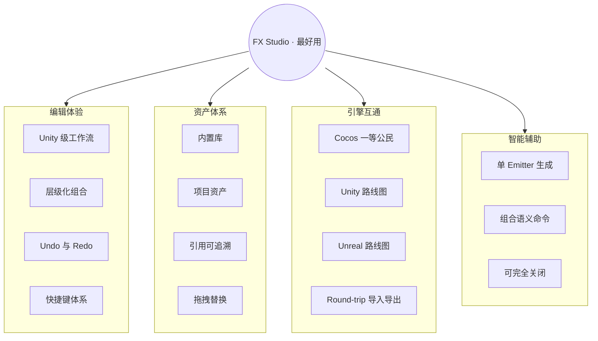
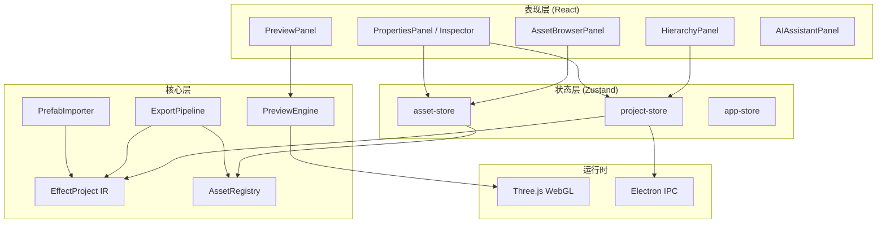
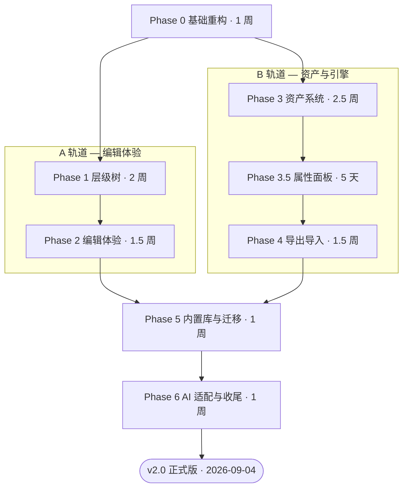
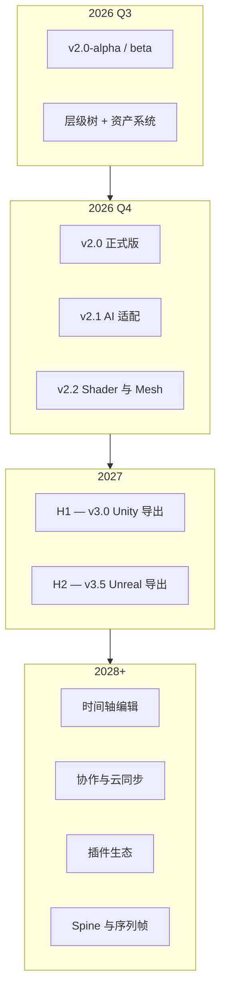

# FX Studio 项目计划书

| 字段 | 内容 |
|------|------|
| 项目名称 | FX Studio（特效工坊） |
| 文档类型 | 项目计划书（Project Plan） |
| 文档版本 | **v1.0** |
| 编制日期 | 2026-07-23 |
| 关联文档 | [PRD-v2](./PRD-v2.md) · [开发步骤表](./DEVELOPMENT-PLAN-v2.md) · [PRD v1](./PRD.md) |
| 产品代号 | `cocos-effect-generator` |
| 计划周期 | 2026 Q3–Q4（v2.0 正式版）→ 2027+（多引擎与生态） |

---

## 目录

1. [执行摘要](#1-执行摘要)
2. [愿景与战略目标](#2-愿景与战略目标)
3. [项目背景与问题陈述](#3-项目背景与问题陈述)
4. [项目目标](#4-项目目标)
5. [项目范围](#5-项目范围)
6. [目标用户与市场定位](#6-目标用户与市场定位)
7. [产品战略与竞争分析](#7-产品战略与竞争分析)
8. [技术方案概述](#8-技术方案概述)
9. [工作分解结构（WBS）与里程碑](#9-工作分解结构wbs与里程碑)
10. [进度计划与甘特图](#10-进度计划与甘特图)
11. [组织与角色分工](#11-组织与角色分工)
12. [资源与成本估算](#12-资源与成本估算)
13. [风险管理](#13-风险管理)
14. [质量管理](#14-质量管理)
15. [沟通与协作机制](#15-沟通与协作机制)
16. [成功标准与 KPI](#16-成功标准与-kpi)
17. [当前进度评估](#17-当前进度评估)
18. [长期路线图（2027+）](#18-长期路线图2027)
19. [附录](#19-附录)

---

## 1. 执行摘要

**FX Studio** 是一款面向游戏引擎的独立粒子特效编辑器。项目的**终极目标**是：

> **做一款最好用的特效制作软件——用户在此完成创作与实时预览后，可将特效导出到 Cocos Creator / Unity / Unreal 中开箱即用。**

### 1.1 项目现状

| 维度 | 状态 |
|------|------|
| v1.x（AI 驱动单 Session 编辑器） | ✅ 已交付：AI 生成、3D/2D 预览、Cocos Prefab 导出/导入、Shader 编辑 |
| v2.0（通用编辑器重构） | 🔄 进行中：层级树、`.fxproj` 项目文件、资产系统、Undo/Redo、多 Emitter 导出等已大量落地 |
| 多引擎导出（Unity / Unreal） | 📋 路线图阶段 |

### 1.2 本计划核心决策

1. **产品重心**：从「AI 对话生成工具」转向「**通用特效编辑器**」，AI 降级为可选辅助能力。
2. **结构升级**：从扁平 Session 升级为 **项目 → 特效组 → 子特效（Emitter）→ 模块** 的层级化组合模型。
3. **资产体系**：建立 AssetRegistry + 资产浏览器 + Inspector 引用槽，告别固定 `particle-circle.png` 导出。
4. **引擎策略**：Cocos Creator 3.8 为**一等公民**；Unity / Unreal 按路线图分阶段扩展。
5. **体验对标**：编辑工作流、快捷键、面板布局对标 **Unity Particle System**，持续打磨「最好用」的手感。

### 1.3 交付时间表（摘要）

| 里程碑 | 目标日期 | 交付物 |
|--------|----------|--------|
| v2.0-alpha | 2026-08 | 层级树 + `.fxproj` + Undo/Redo |
| v2.0-beta | 2026-09 | 资产浏览器 + 引用槽 + 多节点导出 |
| **v2.0 正式版** | **2026-10** | 迁移工具 + 预设项目 + 文档 + 冒烟测试 |
| v2.1 | 2026-11 | AI 适配选中 Emitter + 组合生成 |
| v2.2 | 2026-12 | Shader 资产编辑 + Mesh 渲染完整支持 |
| v3.0 | 2027 H1 | Unity 粒子系统导出 |
| v3.5 | 2027 H2 | Unreal Niagara 导出 |

预估 v2.0 正式版总工期：**8–12 周**（1 人全职等效）。

---

## 2. 愿景与战略目标

### 2.1 愿景（Vision）

成为游戏行业中**最好用的独立特效制作工具**——无论用户是否使用 AI，都能在 FX Studio 内高效完成从构思、组合、调参到导出的完整链路，且导出结果在目标引擎内**零改造即可播放**。

### 2.2 使命（Mission）

- 让 TA / 特效美术**不必进引擎**也能快速迭代复杂组合特效
- 让独立开发者**用内置资产库**即可产出专业级效果
- 让引擎工程师获得**路径一致、结构清晰**的可导入资源
- 让 AI 成为**加速初稿**的可选能力，而非产品唯一入口

### 2.3 战略支柱



### 2.4 「最好用」的定义（可验收）

| 维度 | 「最好用」意味着 | 量化参考 |
|------|------------------|----------|
| 效率 | 组合爆炸（3 Emitter）纯手动搭建 | < 15 分钟 |
| 响应 | 贴图替换 → 预览生效 | < 1 秒 |
| 可靠 | 多节点 Prefab 导入 Cocos | 100% 可播放 |
| 完整 | 关闭 AI 面板后全流程 | 100% 可用 |
| 习惯 | 熟悉 Unity 的用户上手 | < 30 分钟无文档摸索 |

---

## 3. 项目背景与问题陈述

### 3.1 行业背景

游戏特效（粒子、拖尾、光效等）是视觉表现的核心手段。传统工作流要求美术/TA 在引擎编辑器内逐模块调参，存在以下痛点：

- **迭代慢**：每次预览需切换引擎场景、等待编译/加载
- **组合难**：复杂特效（爆炸 = 闪光 + 烟雾 + 光晕）在引擎内需手动建多节点，缺乏专用组合工具
- **资产散**：贴图、材质、Shader 引用关系在引擎 meta 体系中，跨项目复用成本高
- **门槛高**：粒子模块参数多（发射、生命周期、力场、渲染等），非专业人员难以快速出效果

### 3.2 v1.x 结构性问题

v1.x 以 AI 对话为主入口，验证了「自然语言 → 可用特效」的可行性，但暴露结构性缺陷：

| 问题 | 现状 | 用户期望 |
|------|------|----------|
| 特效结构扁平 | 1 Session = 1 粒子系统 | 复杂特效 = 多子特效组合 |
| 历史面板价值低 | 仅 AI 生成快照，手动编辑不记录 | Undo/Redo 替代版本历史 |
| 资产不可见 | 固定导出默认圆点贴图 | 贴图/Shader/模型可引用、可替换 |
| 无资产库 | 无统一资源管理 | 内置基础资产 + 拖拽替换 |
| AI 喧宾夺主 | 左栏默认「对话」 | **先通用编辑器，后 AI 辅助** |

### 3.3 项目机会

- 独立 DCC 工具在特效领域仍有空白（Particle Designer 等已停更或功能有限）
- Cocos / 中小团队对**轻量、可离线、可导出**的特效工具有明确需求
- 现有 v1 代码基座（Three.js 预览、Cocos 序列化、AI 引擎）可复用，**重构成本可控**
- 「AI + 专业编辑器」双轨模式符合 2026 年工具类产品趋势

---

## 4. 项目目标

### 4.1 总体目标

在 **2026 年 Q4** 前交付 **FX Studio v2.0 正式版**，完成从 AI 工具到**通用特效编辑器**的产品转型，并确立 Cocos Creator 3.8 的完整导出/导入闭环。

### 4.2 分项目标（SMART）

| 编号 | 目标 | 指标 | 时限 |
|------|------|------|------|
| G-01 | 层级化组合编辑 | 单项目支持 ≥10 个 Emitter，拖拽 reparent + Undo | v2.0-alpha |
| G-02 | 资产引用闭环 | Inspector 换贴图 → 预览 → 导出一致 | v2.0-beta |
| G-03 | 多节点 Cocos 导出 | 3 Emitter 爆炸项目 round-trip 测试通过 | v2.0 |
| G-04 | v1 用户平滑迁移 | Session → `.fxproj` 一键迁移无数据丢失 | v2.0 |
| G-05 | 无 AI 完整可用 | 关闭 AI 面板可完成新建→编辑→导出全流程 | v2.0 |
| G-06 | 性能基线 | 5 Emitter × 200 粒子，预览 ≥ 30 FPS | v2.0 |
| G-07 | Unity 导出 MVP | 导出 Unity Particle System Prefab 可播放 | v3.0 |
| G-08 | Unreal 导出 MVP | 导出 Niagara System 或等价资产可播放 | v3.5 |

### 4.3 非目标（本阶段不做）

- 完整 3D 场景编辑（地形、灯光烘焙、物理模拟）
- 粒子纹理绘制/程序化贴图生成器
- 团队协作、云同步、版本分支合并
- 移动端独立 App（当前聚焦 Electron 桌面 + Web 开发预览）
- Spine / 序列帧动画编辑器（v2.2 后评估）

---

## 5. 项目范围

### 5.1 功能范围矩阵

| 模块 | v2.0 范围 | 优先级 | 说明 |
|------|-----------|--------|------|
| 复合特效层级树 | ✅ In | P0 | Group / Emitter / 模块展开 |
| `.fxproj` 项目文件 | ✅ In | P0 | JSON，含 hierarchy + assetRegistry |
| Undo/Redo | ✅ In | P0 | 覆盖树操作、Inspector、资产替换 |
| 资产浏览器 | ✅ In | P0 | 内置库 + 项目资产 + 拖拽 |
| 资产引用槽 | ✅ In | P0 | Main Texture / Material / Mesh |
| 多 Emitter 预览合成 | ✅ In | P0 | Solo / Hide |
| 多节点 Cocos 导出/导入 | ✅ In | P0 | Prefab round-trip |
| 内置资产包 | ✅ In | P0 | ≥10 贴图、材质、模型 |
| v1 Session 迁移 | ✅ In | P0 | localStorage → `.fxproj` |
| AI 助手降级 | ✅ In | P1 | 默认折叠，作用域=选中 Emitter |
| 全局属性面板 | ✅ In | P0 | 节点/资产二选一 Inspector |
| 时间轴 | ❌ Out | — | v2.2+ 评估 |
| Unity 导出 | ❌ Out | — | v3.0 |
| Unreal 导出 | ❌ Out | — | v3.5 |

### 5.2 技术范围

| 层级 | 范围 |
|------|------|
| 前端 | React 18 + TypeScript 5 + Zustand 5 |
| 桌面 | Electron 32 + IPC 文件对话框 |
| 渲染 | Three.js 0.169 WebGL 粒子预览 |
| 构建 | Vite 5 + vitest 单测 |
| 数据 | `.fxproj` JSON IR + AssetRegistry |
| 导出 | Cocos Creator 3.8 Prefab / Material / Texture meta |

### 5.3 交付物清单

| 类型 | 交付物 |
|------|--------|
| 产品 | FX Studio v2.0 安装包（Electron）+ Web 版 |
| 文档 | PRD、开发步骤表、用户指南、迁移说明 |
| 资产 | 内置贴图/材质/模型包、预设组合项目（爆炸/魔法/环境） |
| 测试 | vitest 单测套件、E2E 冒烟清单 |
| 代码 | 开源/内部仓库，PR 按 Phase 切分（见开发步骤表） |

---

## 6. 目标用户与市场定位

### 6.1 用户画像（优先级排序）

| 优先级 | 角色 | 核心诉求 | 使用场景 |
|--------|------|----------|----------|
| P0 | TA / 特效美术 | 高效手动搭组合特效、替换贴图材质 | 爆炸、魔法、环境特效 |
| P0 | Cocos 工程师 | 导入 prefab 改造、导出回项目，路径一致 | 引擎 ↔ 工具 round-trip |
| P1 | 独立开发者 | 内置资产快速出效果，可选 AI 加速 | 原型验证、独立游戏 |
| P2 | 策划 / 非美术 | 描述需求 → AI 初稿 → 手动精修 | 需求沟通、快速原型 |

### 6.2 市场定位

```
                    专业度 ↑
                        │
         Houdini       │    Unity/Unreal 内置
         Niagara       │    Particle System
                        │
    ────────────────────┼────────────────────→ 易用性
                        │
         FX Studio ★    │    AI 生成类工具
         （独立+引擎互通）│    （单特效、难精修）
                        │
         Particle Designer（停更）
```

**差异化定位**：比 AI 工具更**专业可精修**；比引擎内置编辑器更**独立高效**；比 Houdini 更**轻量上手**；专注**游戏引擎导出闭环**。

### 6.3 目标引擎策略

| 引擎 | 角色 | 当前状态 | 导出格式 |
|------|------|----------|----------|
| Cocos Creator 3.8 | 一等公民 | ✅ 完整支持 | `.prefab` + `.mtl` + `.png` + `.meta` |
| Unity 2022+ | 扩展 | 📋 路线图 | Particle System Prefab |
| Unreal 5 | 扩展 | 📋 路线图 | Niagara System / Cascade |

---

## 7. 产品战略与竞争分析

### 7.1 竞品对比

| 维度 | FX Studio v2 | Unity Particle System | AI 特效工具 | Particle Designer |
|------|--------------|----------------------|-------------|-------------------|
| 独立运行 | ✅ Electron | ❌ 需 Unity | ✅ Web | ✅ 桌面（停更） |
| 组合多 Emitter | ✅ 层级树 | ✅ Hierarchy | ❌ 通常单系统 | ⚠️ 有限 |
| 实时预览 | ✅ Three.js | ✅ Scene View | ⚠️ 简化 | ✅ |
| Cocos 导出 | ✅ 原生 Prefab | ❌ | ❌ | ❌ |
| AI 辅助 | ✅ 可选 | ❌ | ✅ 核心 | ❌ |
| 资产库 | ✅ 内置+项目 | ✅ Project | ❌ | ⚠️ |
| 价格 | 待定 | Unity 订阅 | 订阅 | 买断（停更） |

### 7.2 核心竞争策略

1. **体验制胜**：持续对标 Unity Particle System 的工作流细节（面板布局、快捷键、Solo、模块折叠）
2. **引擎闭环**：Cocos round-trip 做到「导出即可用」，建立口碑
3. **组合优先**：层级树 + 预设项目降低复杂特效门槛
4. **AI 不绑定**：无 API Key 仍是完整产品，扩大用户面
5. **开源/社区**（可选）：内置资产与模板生态，降低冷启动成本

---

## 8. 技术方案概述

### 8.1 系统架构



### 8.2 核心数据模型

```
EffectProject (.fxproj)
├── version, name, targetEngine
├── assetRegistry: AssetEntry[]
└── root: EffectGroupNode
    ├── transform
    └── children: EffectNode[]
        ├── ParticleEmitterNode
        │   ├── transform, enabled, solo
        │   ├── config: Particle3DConfig (11 模块)
        │   └── assetRefs: { mainTexture, material, mesh? }
        └── EffectGroupNode (嵌套)
```

### 8.3 技术选型

| 领域 | 选型 | 理由 |
|------|------|------|
| 桌面壳 | Electron 32 | 跨平台、文件系统、离线 |
| UI | React 18 + TS | 组件化、生态成熟 |
| 状态 | Zustand 5 | 轻量，与 Undo 快照集成 |
| 预览 | Three.js 0.169 | WebGL 粒子，跨平台一致 |
| 树拖拽 | @dnd-kit（建议） | 轻量、React 18 兼容 |
| Undo | JSON snapshot 栈 | 已实现于 `project-history.ts` |
| 项目文件 | JSON `.fxproj` | 可读、易 diff、后期可 zip |
| 测试 | vitest | 导出/迁移/资产 round-trip |
| AI | OpenAI / Anthropic SDK | 可选，Demo 模式兜底 |

### 8.4 关键技术风险与对策

| 技术点 | 风险 | 对策 |
|--------|------|------|
| 预览 vs 引擎一致性 | 参数映射不完全 | 以 Cocos 序列化为金标准，单测覆盖 |
| 多 Emitter 性能 | 粒子数叠加掉帧 | Solo、粒子上限、Instancing 优化 |
| 资产路径 | 导入导出 UUID 不一致 | AssetRef + meta 同步，round-trip 测试 |
| Electron 体积 | 打包 > 150MB | 内置资产压缩、按需加载 |

---

## 9. 工作分解结构（WBS）与里程碑

### 9.1 WBS 总览

```
FX Studio v2.0
├── 1. 基础重构 (Phase 0)
│   ├── 1.1 类型定义 EffectProject / EffectNode / AssetRef
│   ├── 1.2 .fxproj 序列化 / IO
│   ├── 1.3 project-store 替代 session-store
│   ├── 1.4 Electron 文件对话框
│   └── 1.5 启动页 / 最近项目
├── 2. 层级树 (Phase 1)
│   ├── 2.1 HierarchyPanel UI
│   ├── 2.2 树操作 CRUD + DnD reparent
│   ├── 2.3 Transform Inspector
│   ├── 2.4 多 Emitter 预览合成
│   └── 2.5 Solo / Hide / 复制粘贴
├── 3. 编辑体验 (Phase 2)
│   ├── 3.1 Undo/Redo 命令栈
│   ├── 3.2 移除 VersionHistoryPanel
│   ├── 3.3 工具栏 / AI 面板改版
│   └── 3.4 自动保存
├── 4. 资产系统 (Phase 3)
│   ├── 4.1 AssetRegistry + asset-store
│   ├── 4.2 内置资产包
│   ├── 4.3 AssetBrowserPanel
│   ├── 4.4 AssetSlot + 预览贴图加载
│   └── 4.5 全局 PropertiesPanel
├── 5. 导出导入 (Phase 4)
│   ├── 5.1 多 Emitter Cocos Prefab Builder
│   ├── 5.2 资产打包导出
│   ├── 5.3 多节点 Prefab 导入
│   └── 5.4 round-trip 单测
├── 6. 内置库与迁移 (Phase 5)
│   ├── 6.1 预设组合项目
│   ├── 6.2 v1 Session 迁移
│   └── 6.3 首次启动迁移提示
└── 7. AI 适配与收尾 (Phase 6)
    ├── 7.1 AI 作用域 = 选中 Emitter
    ├── 7.2 文档更新
    ├── 7.3 E2E 冒烟
    └── 7.4 性能 profiling
```

### 9.2 版本里程碑

| 版本 | 主题 | 关键交付 | 目标日期 |
|------|------|----------|----------|
| v2.0-alpha | 结构重构 | 层级树 + `.fxproj` + Undo | 2026-08 |
| v2.0-beta | 资产系统 | 资产浏览器 + 引用槽 + 导出打包 | 2026-09 |
| **v2.0** | **正式版** | 多 Emitter 导出 + 迁移 + 文档 | **2026-10** |
| v2.1 | AI 适配 | 选中 Emitter 生成 + 组合语义命令 | 2026-11 |
| v2.2 | 扩展 | Shader 资产编辑 + Mesh 渲染完整 | 2026-12 |

> 详细任务分解、工时估算、PR 切分见 [DEVELOPMENT-PLAN-v2.md](./DEVELOPMENT-PLAN-v2.md)。

---

## 10. 进度计划与甘特图

### 10.1 Phase 时间线（10 周基准）

| Phase | 内容 | 周次 | 工期 |
|-------|------|------|------|
| Phase 0 | 基础重构 | W1 | 1 周 |
| Phase 1 | 层级树 | W2–W3 | 2 周 |
| Phase 2 | 编辑体验 | W3–W4.5 | 1.5 周 |
| Phase 3 | 资产系统 | W4.5–W7 | 2.5 周 |
| Phase 4 | 导出/导入 | W7–W8.5 | 1.5 周 |
| Phase 5 | 内置库/迁移 | W8.5–W9.5 | 1 周 |
| Phase 6 | AI 适配/收尾 | W9.5–W10.5 | 1 周 |

### 10.2 甘特图

> Cursor / 部分 Markdown 预览不支持 Mermaid `gantt` 图表，以下用**双轨道 flowchart + 文本条**表示同一排期（与 §10.1 一致）。

**双轨道排期（含并行）**



**日历对照（10 周基准）**

| Phase | 07-21 | 07-28 | 08-11 | 08-21 | 08-28 | 09-04 |
|-------|:-----:|:-----:|:-----:|:-----:|:-----:|:-----:|
| P0 基础 | ███ | | | | | |
| P1 层级 | | ██████ | ██ | | | |
| P2 体验 | | | ████ | ██ | | |
| P3 资产 | | ██████ | ████ | | | |
| P3.5 属性 | | | | ██ | | |
| P4 导出 | | | ████ | ██ | | |
| P5 迁移 | | | | | ███ | |
| P6 收尾 | | | | | ███ | ◆ 发布 |

◆ **v2.0 正式版**目标日：2026-09-04（Phase 6 结束）

### 10.3 并行策略

Phase 0 完成后，可并行：

| 轨道 | 负责人 | 任务 |
|------|--------|------|
| A 轨道 | 前端主程 | Phase 1 → 2（层级树 + Undo + 布局） |
| B 轨道 | 工具/引擎 | Phase 3 → 4（资产系统 + 导出管线） |

Phase 5–6 需全员交叉：内置库、迁移、测试、文档。

---

## 11. 组织与角色分工

### 11.1 团队结构（建议最小配置）

| 角色 | 职责 | Phase 重点 |
|------|------|------------|
| 产品负责人 | 愿景对齐、优先级、验收 | 全程 |
| 前端主程 | UI、Store、层级树、Inspector | 0, 1, 2 |
| 工具/引擎工程师 | 导出管线、Cocos 序列化、资产 IO | 3, 4, 5 |
| TA（兼职顾问） | 预设特效、内置资产、体验评审 | 3, 5, 6 |
| QA（兼职） | 单测维护、E2E 冒烟、round-trip | 4, 6 |

### 11.2 RACI 矩阵（关键交付）

| 交付物 | 产品 | 前端 | 引擎 | TA | QA |
|--------|------|------|------|-----|-----|
| PRD / 计划 | A | C | C | I | I |
| 层级树 | A | R | I | C | C |
| 资产系统 | A | R | R | C | C |
| Cocos 导出 | I | C | R | C | R |
| 预设项目 | C | C | I | R | C |
| v2.0 发布 | A | R | R | C | R |

> R = Responsible, A = Accountable, C = Consulted, I = Informed

---

## 12. 资源与成本估算

### 12.1 人力投入（v2.0）

| 阶段 | 人周（1 FTE 等效） | 说明 |
|------|-------------------|------|
| Phase 0–2 | 4.5 | 编辑器核心 |
| Phase 3–3.5 | 3 | 资产 + 属性面板 |
| Phase 4 | 1.5 | 导出导入 |
| Phase 5–6 | 2 | 迁移、收尾 |
| **合计** | **~11 人周** | 含 10% 缓冲 ≈ 8–12 周日历时间 |

### 12.2 基础设施成本（月度估算）

| 项目 | 成本 | 说明 |
|------|------|------|
| AI API（OpenAI/Anthropic） | 按量 | 仅 AI 功能，可 Demo 模式零成本 |
| 代码签名证书 | ~$300/年 | Electron 分发（可选） |
| CI/CD | 免费层 | GitHub Actions |
| 设计资产 | 内部 | 内置贴图自主生成 |

### 12.3 第三方依赖

均为开源免费许可（MIT/ISC/Apache），无额外授权费用。

---

## 13. 风险管理

### 13.1 风险登记册

| ID | 风险 | 概率 | 影响 | 等级 | 缓解措施 | 责任人 |
|----|------|------|------|------|----------|--------|
| R-01 | 预览与 Cocos 播放不一致 | 中 | 高 | **高** | round-trip 单测；以序列化为金标准 | 引擎 |
| R-02 | v2 重构范围蔓延 | 中 | 中 | 中 | 严格 P0/P1 划分；时间轴等明确 Out | 产品 |
| R-03 | 单人开发资源不足 | 高 | 中 | **高** | Phase 并行；砍 P2；分 alpha/beta 发布 | 产品 |
| R-04 | Unity/Unreal 导出复杂度超预期 | 高 | 中 | 中 | 独立 v3.x 里程碑；先 Cocos 做透 | 引擎 |
| R-05 | 用户习惯 v1 Session 模式 | 低 | 中 | 低 | 迁移工具 + 启动页引导 + 预设项目 | 前端 |
| R-06 | 多 Emitter 性能不达标 | 中 | 中 | 中 | Solo、粒子上限、profiling backlog | 前端 |
| R-07 | Electron 安全/更新问题 | 低 | 中 | 低 | electron-updater；依赖定期升级 | 前端 |

### 13.2 关键决策记录

| 决策 | 选择 | 理由 | 日期 |
|------|------|------|------|
| Session vs Project | **Project 文件** | 组合特效需单文件描述整棵树 | 2026-07 |
| 历史 vs Undo | **Undo/Redo** | 符合通用 DCC 工具习惯 | 2026-07 |
| 节点图 vs 层级树 | **层级树为主** | 组合特效以层级为准 | 2026-07 |
| AI 定位 | **可选辅助** | 无 API Key 仍完整可用 | 2026-07 |
| 2D/Shader/Animation | v2.0 仅粒子 | 控制范围，v2.2 扩展 | 2026-07 |

---

## 14. 质量管理

### 14.1 测试策略

| 层级 | 范围 | 工具 | 覆盖目标 |
|------|------|------|----------|
| 单元测试 | IO、导出、迁移、资产解析 | vitest | 核心路径 100% |
| 集成测试 | 3 Emitter round-trip | vitest | 每个 Phase 4+ |
| E2E 冒烟 | 新建→编辑→导出→Cocos | Playwright（可选） | v2.0 发布前 |
| 手工测试 | UI 交互、拖拽、Undo | 测试清单 | 每 alpha/beta |

### 14.2 当前测试资产

已建立 **25+** 单测文件，覆盖：

- `project-io` / `migrate-v1` / `project-history`
- `export-pipeline` / `export-composite` / `prefab-importer`
- `asset-registry` / `asset-resolver` / `asset-apply`
- `preset-projects` / `builtin-assets`

### 14.3 发布门禁（v2.0 Release Checklist）

- [ ] 可创建含 3+ Emitter 的组合特效项目
- [ ] 层级树拖拽 reparent，Undo 可恢复
- [ ] 资产浏览器显示内置贴图 ≥10 张
- [ ] Inspector 可替换 Main Texture，预览即时更新
- [ ] 导出 Cocos：多 ParticleSystem + 正确贴图文件
- [ ] 导入 Cocos 多节点 prefab 为 EffectProject
- [ ] 无「历史」Tab；Ctrl+Z 可用
- [ ] AI 面板可隐藏，隐藏后全流程可完成
- [ ] v1 Session 可迁移
- [ ] `npm run build` + `vitest` 全通过

### 14.4 非功能需求

| 类别 | 要求 |
|------|------|
| 性能 | 5 Emitter × 200 粒子，预览 ≥ 30 FPS |
| 资产 | 内置库总大小 < 5MB |
| 可扩展 | AssetRegistry 插件点 |
| 离线 | 无网络时除 AI 外全功能可用 |

---

## 15. 沟通与协作机制

### 15.1 文档体系

| 文档 | 用途 | 维护频率 |
|------|------|----------|
| [PROJECT-PLAN.md](./PROJECT-PLAN.md) | 项目计划书（本文） | 里程碑变更时 |
| [PRD-v2.md](./PRD-v2.md) | 产品需求 | 功能变更时 |
| [DEVELOPMENT-PLAN-v2.md](./DEVELOPMENT-PLAN-v2.md) | 开发步骤与 PR 切分 | 每周 |
| README.md | 用户快速上手 | 每个正式版 |

### 15.2 节奏建议

| 会议/活动 | 频率 | 参与者 | 产出 |
|-----------|------|--------|------|
| 站会 | 每日（如有团队） | 全员 | 阻塞项 |
| Phase 评审 | 每 Phase 结束 | 产品+开发 | 验收签字 |
| 体验走查 | beta 前 | 产品+TA | UX 问题清单 |
| 回顾 | v2.0 发布后 | 全员 | 复盘文档 |

### 15.3 PR 策略

按 [DEVELOPMENT-PLAN-v2.md](./DEVELOPMENT-PLAN-v2.md) 建议切分 **12 个 PR**，每个 PR：

- 单一主题、可独立 review
- 附带 vitest 增量
- 不超过 3 天开发量

---

## 16. 成功标准与 KPI

### 16.1 v2.0 产品 KPI

| 指标 | 目标 | 测量方式 |
|------|------|----------|
| 组合爆炸搭建时间 | < 15 分钟（纯手动） | 内部走查计时 |
| 贴图替换响应 | < 1 秒 | 预览帧计时 |
| Cocos 多节点导入成功率 | 100% | round-trip 单测 + 手工 |
| 无 AI 功能完整度 | 100% | 功能清单逐项 |
| v1 迁移成功率 | 100% 无数据丢失 | migrate-v1 单测 |
| 单测通过率 | 100% | CI vitest |
| 预览帧率 | ≥ 30 FPS（5×200 粒子） | profiling |

### 16.2 长期商业 KPI（可选）

| 指标 | v2.0 后 6 个月目标 |
|------|-------------------|
| 周活跃用户 | 按发布策略设定 |
| 导出次数 / 用户 | ≥ 3 次/周（活跃） |
| NPS / 体验评分 | ≥ 40 |
| Cocos 社区提及 | 至少 1 篇第三方教程 |

---

## 17. 当前进度评估

> 评估基准日：**2026-07-23**

### 17.1 Phase 完成度

| Phase | 状态 | 已完成要点 | 待完成 |
|-------|------|------------|--------|
| Phase 0 | ✅ ~95% | 类型、project-io、project-store、ProjectWelcome、Electron IPC | 边缘 case  polish |
| Phase 1 | ✅ ~90% | HierarchyPanel、多 Emitter 预览、Transform | DnD polish、多选批量 |
| Phase 2 | ✅ ~85% | Undo/Redo、AI 可折叠、自动保存、工具栏 | 状态栏、部分 UI 统一 |
| Phase 3 | ✅ ~90% | AssetRegistry、AssetBrowser、AssetSlot、真实贴图预览 | 贴图导入落盘等待办 |
| Phase 3.5 | ✅ ~95% | PropertiesPanel、分类型编辑器 | 贴图导入路径 |
| Phase 4 | ✅ ~85% | 多 Emitter 导出、资产打包、composite 测试 | Import polish、ExportModal |
| Phase 5 | ✅ ~80% | 内置资产（12 贴图+材质+模型）、preset-projects、migrate-v1 | 启动页迁移 UX |
| Phase 6 | 🔄 ~30% | 部分文档 | AI 作用域、E2E 冒烟、性能 profiling |

### 17.2 整体评估

**v2.0 整体完成度约 75–80%**，核心架构与 P0 功能已落地。距离正式版主要差：

1. Phase 6 收尾（AI 适配、E2E、性能、文档统一）
2. 发布门禁清单逐项验收
3. 部分 P1/P2 polish（贴图导入落盘、ExportModal 资产清单等）

**预计正式版**：按当前进度，**2026-09 中–下旬** 可达 beta，**2026-10 初** 可发布 v2.0（较计划略提前或持平）。

---

## 18. 长期路线图（2027+）

### 18.1 产品演进



### 18.2 多引擎导出规划

| 版本 | 引擎 | 导出目标 | 关键技术点 |
|------|------|----------|------------|
| v3.0 | Unity 2022+ | Particle System Prefab | 模块映射表、Material、Texture |
| v3.5 | Unreal 5 | Niagara System | 参数映射、贴图、Curve |
| v4.0 | 通用 | USD / glTF 特效（探索） | 行业标准互通 |

### 18.3 「最好用」持续迭代

| 方向 | 内容 |
|------|------|
| 编辑体验 | 曲线编辑器增强、模块预设、快捷键可配置 |
| 预览 | 背景环境、后期、多视角、性能模式 |
| 资产 | 用户资产包分享、社区模板市场 |
| AI | 组合语义（「加一层烟雾」）、参考图生成、参数解释 |
| 协作 | 项目 diff、Git LFS 集成、团队资产库 |

---

## 19. 附录

### 19.1 术语表

| 术语 | 定义 |
|------|------|
| Emitter | 粒子发射器节点，含 Particle3DConfig |
| EffectGroup | 特效组，可嵌套，用于组织多 Emitter |
| AssetRef | 指向 AssetRegistry 的资源引用 |
| IR | Intermediate Representation，`.fxproj` 内存模型 |
| Round-trip | 导出到引擎后再导入 FX Studio，数据一致 |

### 19.2 参考文档

| 文档 | 链接 |
|------|------|
| v2.0 PRD | [PRD-v2.md](./PRD-v2.md) |
| 开发步骤表 | [DEVELOPMENT-PLAN-v2.md](./DEVELOPMENT-PLAN-v2.md) |
| v1.x PRD | [PRD.md](./PRD.md) |
| 文档索引 | [README.md](./README.md) |

### 19.3 信息架构（v2.0 目标布局）

```
┌──────────────────────────────────────────────────────────────────────────┐
│ 菜单栏：文件 | 编辑 | 资产 | 视图 | 工具 | 帮助                            │
│ 工具栏：新建 | 打开 | 保存 | 撤销/重做 | 播放 | 导入 | 导出 | AI助手(可选) │
├──────────┬─────────────────────────────────────────────┬─────────────────┤
│ 层级树    │              中央工作区                       │   属性检查器     │
│ (Scene)  │  视窗：预览 / 节点图（Tab 切换）                │  Transform      │
│          │  时间轴（v2.2+）                              │  模块参数        │
├──────────┴─────────────────────────────────────────────┴─────────────────┤
│ 资产浏览器 — 内置库 + 项目资产                                            │
└──────────────────────────────────────────────────────────────────────────┘
│ 状态栏：项目名 | 选中对象 | 粒子数 | 引擎目标 | 就绪                        │
└──────────────────────────────────────────────────────────────────────────┘
```

### 19.4 变更记录

| 版本 | 日期 | 变更 | 作者 |
|------|------|------|------|
| v1.0 | 2026-07-23 | 初版项目计划书，整合愿景、WBS、进度、风险与路线图 | FX Studio 团队 |

---

*本文档为 FX Studio 项目的高层计划与执行指南。具体功能需求以 [PRD-v2.md](./PRD-v2.md) 为准，具体开发任务以 [DEVELOPMENT-PLAN-v2.md](./DEVELOPMENT-PLAN-v2.md) 为准。*
